## Learning Objectives

In this chapter we will learn:

-   What peripherals are

-   What General Purpose Input/Output is

-   How to control peripherals by writing to registers

-   Bit masking

-   Functionalizing code

## Interfacing with the Outside World

When we introduced the basic components of a computer in Chapter 1, we mentioned they have five primary components: Memory, ALU, Control, Input, and Output. For any computer to have any use, it must have some way to interface with a user, which is the purpose of the input and output components. On your desktop or laptop computer, you may think of these as physical components, such as your keyboard, mouse, monitor, speakers, etc. These are of course necessary for you to interact with your computer.

For an embedded system, being able to interface with another system is of upmost importance and may require less-obvious needs. Embedded systems may need to interface with another circuit by reading a digital voltage and interpreting it into a 1 or 0. They may need to read an analog voltage and convert it into a digital value for processing, such as reading the signal from a microphone. They may need to interface with another microcontroller and communicate using a specific protocol. Given all of these possible input and output needs an embedded system might have, how are these interfaces created? The answer comes in the form of a **peripheral**. A peripheral is a separate hardware component included in the microcontroller’s architecture to perform some task, typically providing one of these input or output interfaces.

## General Purpose Input Output

Let’s focus on the most fundamental peripheral found in nearly every single microcontroller, the **General-Purpose Input Output** (GPIO). The GPIO peripheral allows the microcontroller to read or set digital voltages on certain pins of the chip. This allows the microcontroller to create some of the most basic forms of inputs and outputs, such as illuminating an LED or reading a button press.

First, let’s recall what is meant my “digital” voltage. A digital voltage is a voltage that represents either a 1 or a 0. How these 1’s and 0’s are represented may vary depending on the microcontroller, but for the most part, a 0 is represented by 0 volts, and a 1 is represented by the operating voltage of the microcontroller, which tends to be either 5 or 3.3 volts. When speaking ambiguously about these voltages, we will often use the terms **high** and **low** voltages to refer to whatever the voltage is that represents a 1 and a 0 in the system, respectively. The microcontroller will interpret any voltage that is near those values as such, but voltages that fall in between may be up to the microcontroller’s interpretation and should avoided when using GPIO.

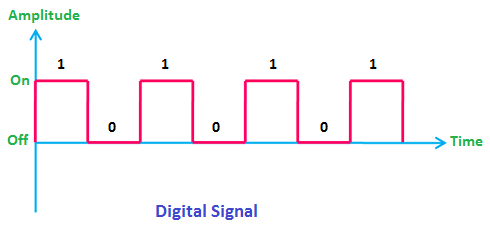{#fig-ch03-3-1}

\<Note: Modify image to show “gray” areas between digital values. Change “On” and “Off” to voltage values\>

### Controlling an LED

As mentioned before, these digital signals can be used to apply either high or low voltages to the external pins of the microcontroller. We can connect these pins to external circuits to do things such as illuminate an LED or read a button press. Let’s consider an example of illuminating an LED using the GPIO pin of a microcontroller. Let’s say we have generic microcontroller with a GPIO peripheral that controls a pin labeled “P1”. Attached to P1 we have a small resistor in series with an LED, which is then connected to ground, as shown in Figure 3.2.

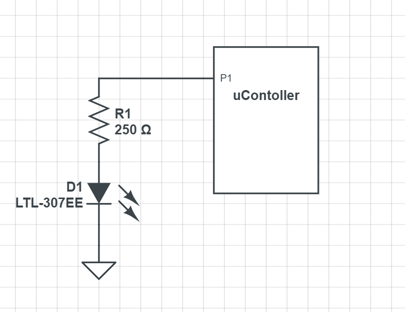{#fig-ch03-3-2}

When the GPIO provides a high voltage on P1, a current is generated which flows from P1, through the resistor, then the LED, then to ground. When current flows through the LED, it emits light. If the GPIO writes a low voltage to P1, which low is typically always 0 for GPIO, we now have no electrical potential across the LED, as the voltage on ground is also 0. For current to flow, a path from a higher voltage to a lower voltage must be provided, and here we have none, so the LED turns off.

### Reading a Button Press

Let’s consider another common GPIO application, reading a button press. To read a button press, we need to have a switch that can control when a high or low voltage is presented to the GPIO input pin. We’ll use the same generic microcontroller as in the previous example, but this time P1 will be used to read the voltage rather than produce a voltage. We’ll connect P1 to a resistor that is wired to a high voltage source, and also to a switch which will connect the pin to ground, which can be see in Figure 3.3.

{#fig-ch03-3-3}

When the switch is closed, P1 is directly connected to ground, and will read 0 volts; all the voltage is dissipated across the resistor in this scenario as well, and none of the current flows into the microcontroller through P1. When the switch is open, there is no longer a direct path to ground, and the current is forced to flow into P1 and through the microcontroller. The input for GPIO pins tends to be of an extremely high resistance, and therefore most of the voltage is dissipated through the microcontroller. This means that only a very small (negligible) amount is lost across the resistor and P1 reads a high voltage.

We’ve now covered the two most fundamental input/output scenarios for an embedded system. This is good in theory, but how do we achieve this on the MSP430FR2355? Let’s learn how to control the GPIO on this microcontroller.

### Peripherals and the Memory Map

From the perspective of an individual instruction, there are only two things a line of code can control: the operation (add, subtract, etc.) and the memory location it writes the result. So, in order to control these peripherals using program instructions, they need to appear like memory locations so the instructions can write to them. Each peripheral contains many **control registers**, which are just like any other memory unit, except the data written to these registers will dictate how that peripheral behaves. For GPIO, that might be indicating whether a pin is an input or output, whether we write a high or a low to a pin, or if we read a high or low on a pin.

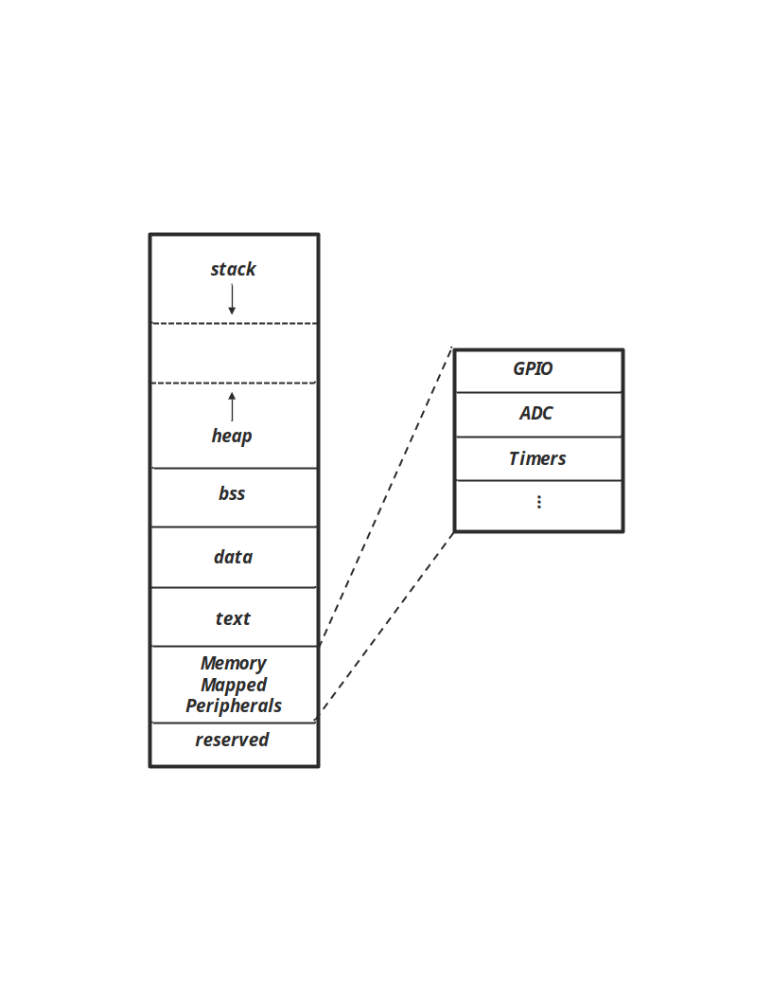{#fig-ch03-3-4}

### The MSP430FR2355 Memory Map

Microcontroller programming is heavily centered around reading and writing to peripheral control registers. Therefore, the memory map is very important to the programmer developing code for the microcontroller. Each microcontroller has a different memory map, so to know where our control registers reside in memory, we will need to consult the datasheet or user’s manual to find out. A **datasheet** is an accompanying document that describes many of the physical characteristics of the microcontroller, such as physical dimensions of the packaging, pinout descriptions, electrical characteristics, etc. Sometimes the datasheet may contain information about the memory map, but for TI products, the user’s manual contains this information. The **user’s guide** has detailed descriptions of the microcontroller’s architecture, memory map, and peripherals; essentially everything the programmer needs to know to use the microcontroller. We’ll learn that much of embedded systems involves reading user’s guides and datasheets to understand how to integrate various existing components into our designs.

The MSP430G2553’s memory map can be seen in Figure 3.6. In this figure, we see the memory map’s regions divided up into various address ranges. Some of the regions we’ve encountered before aren’t present here, such as data, BSS, and stack, and are all simply listed as RAM. Since these regions are all regions that can be written to at runtime, their boundaries are defined by software and not the hardware itself. The compiler is responsible for setting those boundaries and creating instructions that behave within them. This diagram shows boundaries that have some important physical hardware connections, such as the peripherals. We can see in this diagram what memory locations belong to peripherals.

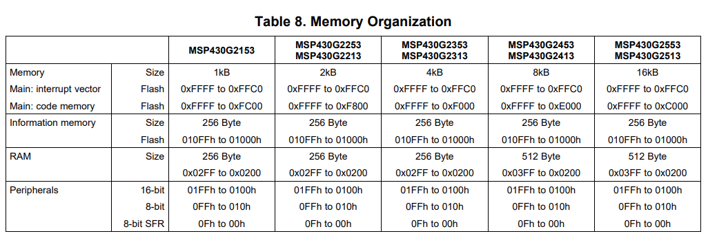{width="2.16498031496063in" height="2.5910247156605424in"}{width="1.4410400262467191in" height="2.6379385389326333in"}

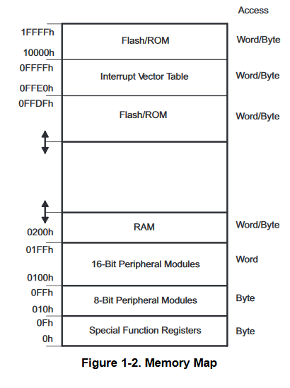{#fig-ch03-3-6}

### The MSP430G2553 GPIO Peripheral

The MSP430G2553 has a fairly standard GPIO peripheral. The TI documentation refers to it as simply “Digital I/O”, but this is still a general-purpose input/output peripheral. The MSP430G2553 has a 40-pin chip, and many of these pins can be controlled by the GPIO peripheral. However, the GPIO peripheral itself can only manage up to 16 pins per module, so the architecture includes three individual GPIO peripherals, allowing control over nearly every pin, excluding the pins for power and ground. Three GPIO units can potentially control up to 48 pins, but since the package only has 40, some of these are unused.

Figure 3.7 shows the block diagram of the MSP430G2553 architecture. This diagram contains a lot of items we aren’t familiar with yet, but it does contain some that we can identify, based on our understanding of the five basic components of a computer. To the far left, we can see a block labeled “16-MHz CPU including 16 registers”. This is the processor (ALU and control) component of the computer. That means everything else must be classified as input/output or memory. We mentioned earlier, that to control the input/output, or peripherals as we now know them, they must appear as memory addresses. Figure 3.6 indicated this by illustrating control registers as locations within a contiguous block of memory. This is how the hardware might “appear” to the instructions; but in reality, these memory addresses are spread out across multiple hardware components, such as our GPIO modules. They appear as memory addresses due to the fact they are wired into the memory bus. The **memory bus** is what connects all components to the memory map, often accompanied by a memory bus controller. When the processor reads or writes to a location, that location is accessed through this bus, whether it’s actual RAM or a peripheral control register. We can identify our three GPIO peripherals in Figure 3.7 as the blocks in the top right of the diagram labeled “I/O Ports”.

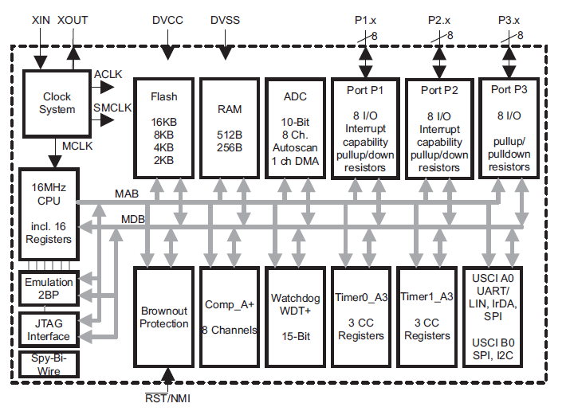{#fig-ch03-3-7}

We see that each GPIO peripheral has a different nomenclature describing the module. Each module is referred to as “Port” followed by a number. At the top right of the diagram in Figure 3.7, we see a GPIO module called “Port P3”. Each port controls 8 GPIO pins each.

### Which pins have GPIO?

From here you might be wondering, which pins do each of these ports control? And that is a question that has to be answered by the datasheet. Within that document, it will identify which pins on the package are connected to which ports on the GPIO module. Some microcontrollers might come in different package sizes as well, so it’s important to consult the documentation for this. Figure 3.8 shows an excerpt from the datasheet indicating the pinout of the chip. On this diagram, we will notice each pin has many different acronyms associated with it. This is because apart from the GPIO, several of the pins might share a connection with some other peripherals. We can identify the pin with a GPIO connection based on the ones labeled with a port / pin combination. We mention earlier that each GPIO module is separated by port, and each port can control up to 8 pins each. Therefore, the pin with the label, P1.3, has Port 1 Pin 3 attached to it. And similarly, the pin labeled P2.0 has Port 2 Pin 0 attached to it.

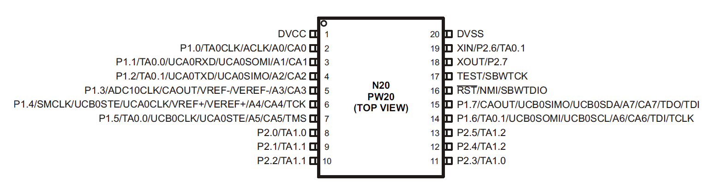{#fig-ch03-3-8}

Since we’re using a development board, the pins on the chip have been connected to the male header pins on the sides of the board. To make identification of the port and pin each one is attached to easy, the development board has included some images that use the same abbreviations to indicate which peripherals are available on which pins. This diagram is shown in Figure 3.9.

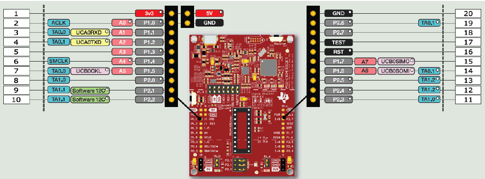{#fig-ch03-3-9}

## Controlling the GPIO

We have discussed the why and where of the GPIO peripherals; now let’s discuss the how. In order to control the GPIO hardware we have to write to its control registers. The control registers are memory units in the hardware itself, where each bit in the register alters the behavior of the peripheral. There are many control registers associated with the GPIO peripheral, but to start let’s focus on the most essential.

### Direction Register

Before doing anything with the GPIO pins, we first have to establish one thing: is the pin an input or an output? Are we reading or writing to the pins? The direction register sets this property for each pin of the microcontroller that it controls. The register itself is 8 bits wide, and if you recall, each GPIO module controls 8 pins. Therefore, each bit in the direction register will determine the direction (input or output) of the pin. For the MSP430G2553, writing a 0 to a bit sets the corresponding pin as an input, and writing a 1 sets it as an output. We will see this relationship of an individual bit within a register corresponding to a pin on the microcontroller used many times when discussing GPIO. Figure 3.10 illustrates how the direction register of P1 is tied to each pin that it controls. For the sake of illustration, the pins appear in sequence, but as it can be seen in Figure 3.8, these pins can be wired to various legs all around the chip and not in any particular order.

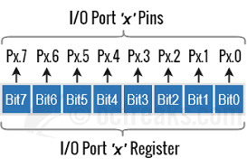{width="2.84375in" height="1.9270833333333333in"}

Figure 3.10: Port bit and pin relationship

### Output Register

The output register controls whether a high or low voltage is written to a pin. Like the direction register, the output register is an 8-bit register with each bit wired to control a single, corresponding pin. Writing a 1 or a 0 to an individual bit in the register will cause a high or low voltage, respectively, to be produced on its corresponding pin. In order for these voltages to be produced, the corresponding pin must have been configured as an output pin in the direction register.

### Input Register

The input register is another 8-bit register that contains the digital value of the corresponding voltage on a pin. With the input register, we can read digital voltages produced from other circuits. Each bit will hold a 1 or a 0 if a digital high or low is read on the corresponding pin. Unlike the direction and output register, this register is read only, so it cannot be written to by the software.

### Pullup or Pulldown Resistor Enable Register

In Figure 3.3 we described how to use GPIO to read a button press. This example used a switch to connect a pin directly to ground when pressed, but when disconnected, a “pull-up” resistor connected the pin the voltage source. The use of pull-up resistors and their inverse, a pull-down resistor (which connects to ground rather than the voltage source), are common enough in embedded systems that the GPIO module includes them right in the peripheral hardware so we don’t have to wire our own externally!

The Pullup/Pulldown Enable Register is 8-bit wide and will enable a pull-up or pull-down resistor based on whether the corresponding bit contains a 1 or 0. If the bit contains a 1, the resistor is enabled. If it contains a 0, it is disabled. The next question is how do we select a pull-up or pull-down? In this case, we let the output register do double duty for us.

Since pull-ups or pull-downs are only relevant when reading a voltage, such as in the button example earlier, we really only care to enable them when the direction register has configured the pin of interest as an input. If the pin is an input, then the bits in the output register that correspond to that pin have no purpose. Therefore, we can give those pins a purpose by allowing them to select a pull-up or pull-down resistor when the corresponding pin’s pullup/pulldown register bit has been enabled.

### The GPIO Hardware

Let’s take some time and observe how the control registers create the hardware functionality we just described.

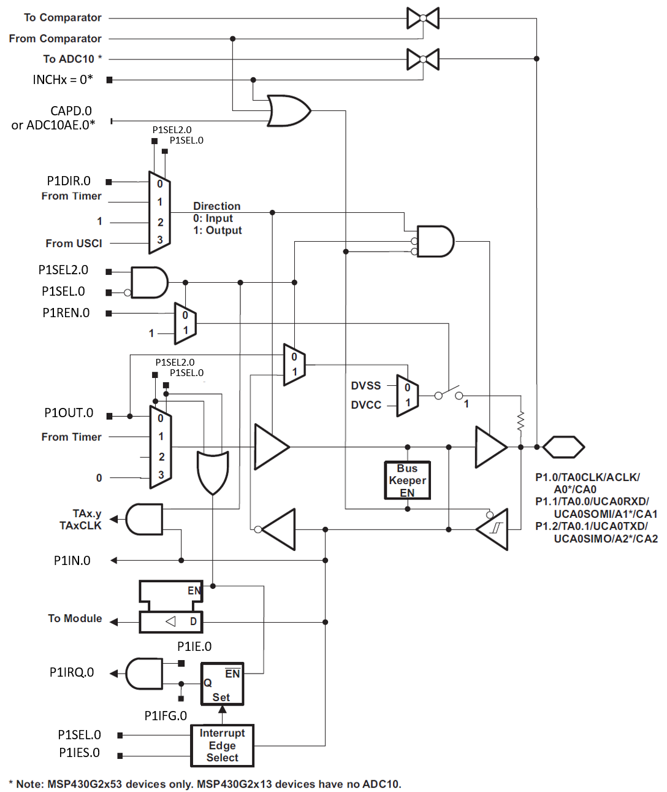{#fig-ch03-3-11}

### Example: Setting an LED

Let’s revisit the example we discussed earlier where we used the GPIO to turn on an LED connected to one of the pins. For this example, we’ll say there is an LED connected to port 1 pin 3. If we want to write a high voltage to that pin, we must first set the pin’s direction as an output. We know that we’ll need to write a 1 to the appropriate position within the direction register, but how do we achieve this in a C program? We know that registers are mapped into memory, so we need to know the address where it resides. We can find this address by consulting the documentation.

The table in Figure 3.12 shows the address ranges for the P1, P2, P3 peripherals. This table gives us each register’s name and associated address. We can see that P1’s direction register is mapped to address 0x022.

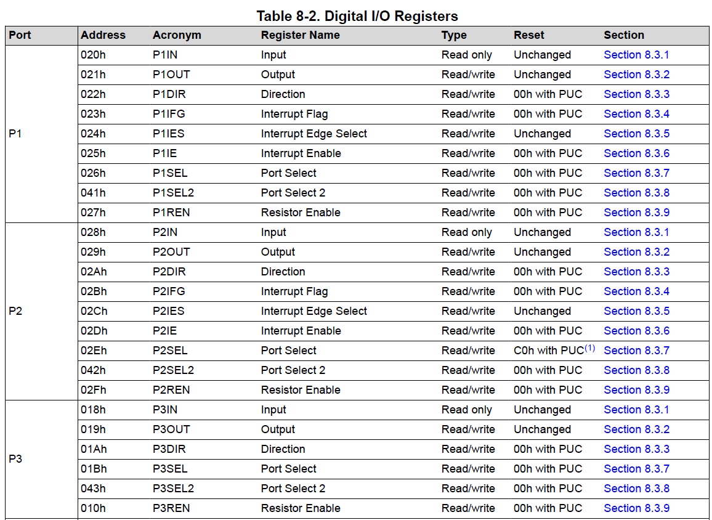{#fig-ch03-3-12}

Now that we know P1’s directional register address, 0x022, how do we write to that memory location? In the C programming language, we learned that pointers are variables that hold the address to another variable. Therefore, we can make a pointer variable, assign it the address of the register, then dereference the pointer to write to the desired register. This code may look like:

```c
volatile unsigned char* p1dir = (unsigned char*) 0x022;
```

Here we used an unsigned character pointer to point to our register. The reason an unsigned char was used is because the char data type is 8 bits, and so is our direction register. We also declared it unsigned, because the value we write to a control register such as this has no numerical significance, and therefore the two’s complement interpretation is meaningless for that number. We also had to cast the address to the type of pointer we are assigning. Another aspect to note is the inclusion of the **volatile** keyword. The volatile keyword prevents the compiler from optimizing out any instructions containing the variable. Sometimes, register assignments may look confusing to the compiler, or as if they do not do anything at all from an algorithmic perspective, and therefore get “optimized” out of the program when compiled. Because of this, all pointers to registers that we create will include the volatile keyword.

Now that we have access to Port 1’s direction register through the pointer, we can write Pin 3 as an output. Each bit in the register corresponds to the pin with the same enumeration, so we need to write a 1 in the first bit position (we begin counting at 0, so pin 0 is the first bit from the left side).

```c
*p1dir = 0x01; // writes 00000001 to p1 direction register
```

We’re only concerned about pin 0, so we’ll just leave all the other pins as 0’s, which will set them all as inputs for now. The only thing left to do is write to the output register to create a high voltage. Just as before, we’ll begin by creating a pointer to the output register’s address. The address according to Figure 3.12 is 0x021.

```c
volatile unsigned char* p1out = (unsigned char*) 0x021;
```

Now we just need to write a 1 to the bit 0 position to create a high voltage on pin 0.

```c
*p1out = 0x01; // writes 00000001 to p1 output register
```

And that’s it! From here on we can write either a 1 or a 0 to the first bit on the output register to turn the LED on and off, respectively. Since all the other pins were configured as inputs, whether a 1 or a 0 was written to the other bit positions doesn’t really matter. We’ll see that a large component of embedded systems is reading and writing to these register memory addresses, which is known as **register level programming**.

From a hardware perspective, let’s consider what the effects of these control register values have. There are many registers associated with the GPIO, but since we’ve only set two registers for this application, we’ll assume the others are all set to 0’s. Figure 3.13 shows the hardware for Pin0 in Port 1 with the configurations specified in the previous lines of code. The red lines represent digital high values. From here we can see that The direction register enables the buffer which allows the high value in the bit 0 position of port 1 to be forwarded to the output. We’ll also note that there are two signals, P1SEL0 and P1SEL1, which control the two multiplexors. When they are set as 0, as they are in this example, the values of the P1DIR and P1OUT register are forwarded to the circuit. The GPIO might have other modules connected to it as well, which is why the multiplexors appear in this circuit. We’re only using the basic GPIO functionality here, so we leave those as 0 and effectively ignore any other peripheral hardware connected to this circuit.

{#fig-ch03-3-13}

### Example: Reading a Button Press

For the next example, we’ll revisit the example earlier where we read a button press. This time, we’ll consider that we have a button configured as it was in Figure 3.3, with the button attached to Port 1 Pin 3. Just as we did in the LED example, we’ll have to begin by specifying the pin’s direction. We’ll write a 0 to the bit 3 position of the direction register to achieve this.

```c
volatile unsigned char* p1dir = (unsigned char*) 0x022;
*p1dir = 0x00; // writes 00000000 to p1 direction register
```

This will configure all 8 pins as inputs on port 1, but most importantly, pin 0 gets configured as such. For the specified circuit, everything is configured now, and all we have to do is read the input register to see if the button is pressed. Our button is connected to ground, so that means if we see a 0 in the bit 0 position, the button is pressed, and a 1 indicates otherwise. Just as with any other register, we’ll need to make a pointer to interact with the associated memory location. The input register has an offset of 0 from the base address, so it will reside at the same address as the base address.

```c
volatile unsigned char* p1input = (unsigned char*) 0x020;
volatile unsigned char p1data = *p1input; // reads p1input and stores the result
```

We can now evaluate the “p1data” variable to determine if the button is pressed.

The circuit in Figure 3.3 includes a pull-up resistor, but we discussed that the GPIO peripheral has the capability of configuring an internal pull-up resistor. We can configure the internal pull-up and then exclude the external pull-up resistor, reducing the circuit complexity and cost by removing components. To enable the internal pull up, we just need to set the enable bit in the pull-up/pull-down resistor enable register and set the associated bit in the output register to select which type of resistor we are enabling. The code to achieve this would appear as follows:

```c
volatile unsigned char* p1dir = (unsigned char*) 0x022;
*p1dir = 0x00; // writes 00000000 to p1 direction register
volatile unsigned char* p1ren = (unsigned char*) 0x027;
*p1ren = 0x01; // writes 00000001 to p1 pull-up enable register
volatile unsigned char* p1out = (unsigned char*) 0x021;
*p1out = 0x01; // writes 00000001 to p1 output register
```

Now we can read the button press without the external pull-up. Note that the register address for the pull-up/pull-down resistor enable register is 0x06 from the base address.

Figure 3.14 shows the condition of the Port 1 Pin 0 hardware given the configuration above and when reading a high voltage. In this diagram we will be ignore the JTAG lines, as they are beyond the scope of what we’re trying to illustrate here. The important things to notice are how the P1REN.0 line enables the switch, which is then connected to either power (DVCC) or ground (DVSS) depending on P1OUT.0, which determines whether a resistor is a pull-up or pull-down.

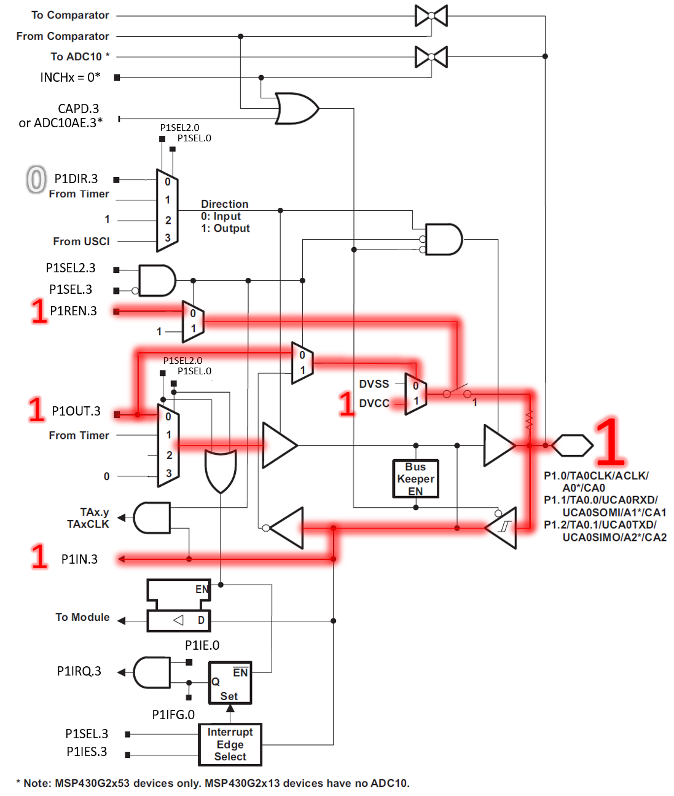{#fig-ch03-3-14}

### Example Reading a Button Press and Setting an LED

Before moving on, let’s consider one final example where we will combine the two previous examples. We’ll say that we have an LED attached to Port 1 Pin 3 and a button on Port 1 Pin 0, which connects to ground when pressed. This circuit is illustrated in Figure 3.14. We want to write an application that will turn the LED on when the button is pressed. Let’s consider what we’ll need to achieve this.

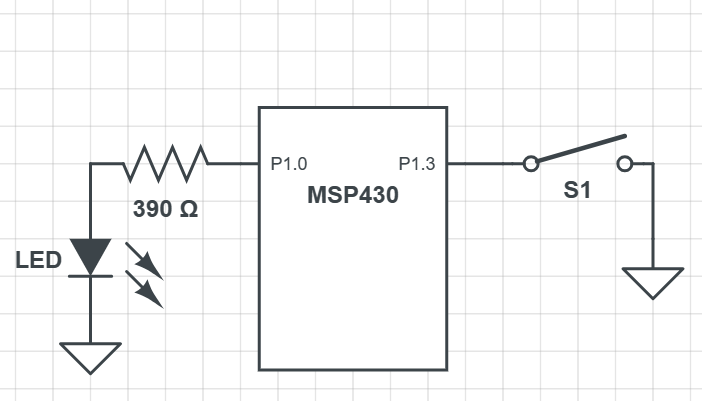{#fig-ch03-3-15}

Let’s begin by creating pointers to the registers we want to configure:

```c
volatile unsigned char* p1in = (unsigned char*) 0x020;
volatile unsigned char* p1out = (unsigned char*) 0x021;
volatile unsigned char* p1dir = (unsigned char*) 0x022;
volatile unsigned char* p1ren = (unsigned char*) 0x027;
```

Now we can write to each of those pointers. We want Port 1 Pin 0 as an output, and Port 1 Pin 3 as an input. This means we want a 0 in the fourth bit, and a 1 in the first bit, and we’ll write 0’s to all the others, because for this application, we don’t care what they are because they aren’t being used.

```c
*p1dir = 0x01; // writes 00000001 to p1 direction register
```

The directions are set, let’s also ensure that the LED starts set off, and we’ll also enable the pullup resistor for pin 0.

```c
*p1ren = 0x08; // writes 00001000 to p1 resistor enable register
*p1out = 0x08; // writes 00001000 to p1 output register
```

Remember that p1out sets the output voltage for pins configured as output but selects the pull-up or pull-down configuration for inputs that have their pull enable bit set. What’s important here is that port 1 bit 0 has a 0 (to turn off the LED) and bit 0 has a 1 (to configure a pull-up resistor).

Lastly, we need to read the input register and see if port 1 bit 3 has a 1 or 0 to determine if the button is pressed, then set the appropriate LED condition.

```c
if((*p1in & 0x08) == 0x00){
    *p1out = 0x09; // 00001001 (LED on, pull-up enabled)
} else {
    *p1out = 0x08; // 00001000 (LED off, pull-up enabled)
}
```

Here, the if condition dereferences the input register and checks if bit 3 is 0 (Using a process called “bit-masking”. We’ll discuss this later). If they are equal, then that means the button is pressed, and we want to turn the LED on. On the following line we do that by writing to the output register. We want to set a 1 in the bit 3 position, but we want to make sure we keep a 1 in the bit 0 position as well, otherwise we’d lose our pull-up resistor. In the else condition we catch if the button is not pressed (as the input register would be holding 0x01, when not pressed), and we write again to the output register 0x08, which will set a 0 to the bit 0 but keep a 1 on bit 3 for the pull-up.

Putting the code all together, we would get the following:

```c
int main(){
    // Stop the [watchdog]{.underline} timer
    volatile unsigned int* wdtctl = (unsigned int*) 0x0120;
    *wdtctl = 0x5A80;
    volatile unsigned char* p1in = (unsigned char*) 0x020;
    volatile unsigned char* p1out = (unsigned char*) 0x021;
    volatile unsigned char* p1dir = (unsigned char*) 0x022;
    volatile unsigned char* p1ren = (unsigned char*) 0x027;
    *p1dir = 0x01; // writes 00000001 to p1 direction register
    *p1ren = 0x08; // writes 00001000 to p1 resistor enable register
    *p1out = 0x08; // writes 00001000 to p1 output register
    while(1){
        if((*p1in & 0x08) == 0x00){
            *p1out = 0x09; // 00001001 (LED on, pull-up enabled)
        } else {
            *p1out = 0x08; // 00001000 (LED off, pull-up enabled)
        }
    }
}
```

There are a few additional observations to be made regarding this program. First is the inclusion of the “while(1)” loop. This is an infinite loop and is found in nearly all embedded systems C programs. While infinite loops are generally considered a negative thing, in embedded systems we want our functionality to loop until the device is no longer powered, which the infinite while loop provides. A “1” is placed in the while’s condition, which evaluates as true.

At the top of the code, we have some additional lines included. These are to disable the watchdog timer and unlock the GPIO. On power up, the MSP430 will enable a watchdog timer (which resets your program if not handled). This is a safety feature which we will elaborate on later in the book.

### Going Further Beyond

We’ve covered the basics of GPIO in this chapter, but there are still many more control registers associated with GPIO. However, we don’t have all the context and motivation to understand them yet, so we’ll introduce them as they become relevant in later chapters. For now, it’s important that the fundamentals of reading and writing to the GPIO are well understood, as this content will serve as our foundation for interacting with other peripherals throughout this book.

## Register Macros

Using pointers, we are able to write to any of the register macros that we need to and have total control over the hardware. However, it can be quite tedious to have to create the pointer and dereference it every time we want to write to a peripheral. We can condense this code by creating preprocessor macros to make writing to memory locations easy.

Preprocessor macros are the lines of code that begin with the “#” sign. These lines get replaced by actual C syntax after the preprocessor runs, according to what the macro contains. To make writing to registers easy, we’ll use the #define directive to create dereferenced pointers that have names associated with the register locations they represent.

Let’s start with the port 1 direction register:

```c
#define P1DIR *((volatile unsigned char*) 0x022)
```

The define preprocessor directive will replace the text that follows the keyword (P1DIR in this case) with the code or value that follows. Now we can just use the text, “P1DIR”, anytime we want to write to that register. This macro will replace any instance of “P1DIR” in our code with the declared, cast, and dereferenced pointer, allowing us the easily read and write to that memory location.

For example, we can adapt the code example earlier into the following:

```c
#define P1IN *((volatile unsigned char*) 0x020)
#define P1OUT *((volatile unsigned char*) 0x021)
#define P1DIR *((volatile unsigned char*) 0x022)
#define P1REN *((volatile unsigned char*) 0x027)
#define WDTCTL *((volatile unsigned char*) 0x0120)
int main(){
    // Stop the watchdog timer
    WDTCTL = 0x6980;
    P1DIR = 0x08; // writes 00001000 to p1 direction register
    P1REN = 0x01; // writes 00000001 to p1 resistor enable register
    P1OUT = 0x01; // writes 00000001 to p1 output register
    while(1){
        if(P1IN == 0x00){
            P1OUT = 0x09; // 00001001 (LED on, pull-up enabled)
        } else {
            P1OUT = 0x01; // 00001000 (LED off, pull-up enabled)
        }
    }
}
```

Now, all the locations where we once created a pointer to dereference it have been replaced with the defined macro at the top of the code. This not only makes the code more concise in the long run, but also easier to read.

Manufacturers of microcontrollers understand this quite well, and to make their products more attractive to the programmers who might be designing embedded systems that use them, header files are often created that contain macros for all of the different registers and their addresses. Texas Instruments is no different, and they have included a header file that provides just that. If we are using CCS, we can update our code to include this header file and not have to define each of these macros ourselves:

```c
#include <msp430.h>
int main(){
    // Stop the watchdog timer
    WDTCTL = 0x6980;
    // Disable the GPIO power-on default high-impedance mode
    PM5CTL0 = 0xFFFE;
    P1DIR = 0x08; // writes 00001000 to p1 direction register
    P1REN = 0x01; // writes 00000001 to p1 resistor enable register
    P1OUT = 0x01; // writes 00000001 to p1 output register
    while(1){
        if(P1IN == 0x00){
            P1OUT = 0x09; // 00001001 (LED on, pull-up enabled)
        } else {
            P1OUT = 0x01; // 00001000 (LED off, pull-up enabled)
        }
    }
}
```

By adding the preprocessor macro “#include \<msp430.h\>” at the top of our code, CCS will add the appropriate header file that contains the register macros for our target MSP430 microcontroller. Now we don’t have to define the macros ourselves and get straight into writing code to make our applications work.

## Bit Masking

When we are manipulating individual bits on a control register, one of our biggest concerns is being able to read and write to individual bits. As we saw earlier, if I want to observe is my button is pressed or not, I need to read a single bit. However, since memory is divided into 8-bit locations, this is not possible, as I have to read at minimum 8 bits at a time. If we want to isolate a single bit, we’ll need to use something called a **bit mask** to single it out. Bit masks are binary values constructed in such a way that when logical ANDed or ORed with another binary value, they will zero out all other bits apart from the one of interest. It “masks off” the bits we aren’t interested in, just like you would apply masking tape when painting a wall to prevent painting on undesired surfaces.

### Bit Masking for Inputs

Let’s consider the example where we want to read the button press on bit 3 of Port 1. To obtain the status of the button, I’m interested in whether bit 3 of the register is a 0 (button is pressed) or a 1 (button is not pressed). However, there is no way to simply read a single bit of an input port register – I can only read the entire register, which is 8 bits long and contains the status of all 8 pins on the input port. So how do I isolate a single bit from a register? The answer is bit-masking, where we will construct a specific binary pattern that can be applied to the register’s contents via bit-wise logical operators to perform operations on individual bits.

### Understanding the Problem

Before describing the process of bit masking, let’s take a moment to understand the problem here. We want to know whether bit 3 is a 1. If we just read all eight bits of the register, couldn’t we simply do the following?:

```c
if(P1IN == 0x08)
```

Here we are accessing the entire register, P1IN, and checking if the contents equal to having a 1 in the bit 3 position. However, this only works if there is no other high voltages on all the other bits. Let’s consider the case where we have a second button on bit 2. If that pin were to also generate a 1, P1IN’s contents would contain 0b00001100 or 0x0C in hex. Therefore, if we wanted to check bit 3 and ignore bit 2’s inputs, we could not compare the register’s contents to 0x08.

### Creating a Bit Mask

If I want to observe only bit 3 and check if it is a “1” or a “0”, I can create an 8-bit mask with the following value: 0b0000 1000 or 0x08 in hex. I can then perform a bitwise AND operation with the input register and this value:

```c
if((P1IN & 0x08) == 0x00)
```

The bitwise AND operation (&) will perform a logical AND with each bit in the two values as seen in Figure 3.16.

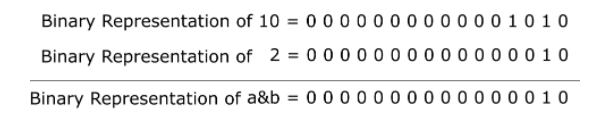{#fig-ch03-3-16}

Now, if the button is not pressed, the result of the bitwise AND will result in 0b0000 1000 regardless of the contents of the other bits, as the bitwise AND with the mask will have set them to 0. With this mask we can compare the result to 0x00 or 0x01 to check for either state of the button.

### Bit Masking for Setting Bits

We are also often interested in manipulating an individual bit as well. We can utilize bit masks for this purpose too. When we want to set an individual bit in a register we can use the bitwise OR operator ( \| ) to achieve this. Figure 3.17 illustrates bitwise OR operator.

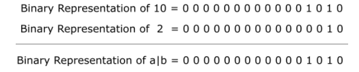{#fig-ch03-3-17}

Let’s say we want to set pin 0 in port 1 as an output, therefore requiring a 1 to be in the fourth bit position. If I’ve already set other pins as inputs and outputs within the register and do not want to accidentally overwrite those values, I can use a logical OR with the current register contents and a bit mask with a 1 in the bit 0 position.

```c
PDIR = PDIR | 0x01; // PDIR | 00000001
```

By using the bitwise OR, only the bits with 1’s in the positions of the mask will be set. This works great for setting bits, but the OR operator can only write 1’s, it cannot clear them. Therefore, if we want to clear a bit, we need to create a mask that places 1’s in the positions we want to leave undisturbed and 0’s in the positions we want to clear. We’ll then use the bitwise AND operator to clear bits. For instance, if I wanted to set bit 0 as an input, I would write:

```c
PDIR = PDIR & 0xFE; // PDIR & 11111110
```

### AND and OR Assignment Operators

Often when bit masking, we are applying a mask to a register then assigning the result of that operation back to the register we just applied it to. Because of the frequency of these operations, the C language provides an operator shortcut just for this. We can reduce the following operation

```c
PDIR = PDIR | 0x01;
```

To

```c
PDIR |= 0x01;
```

Which are equivalent. The “\|=” operator performs a logical OR with the contents on the left side with the right and assigns the result back to the left. Likewise, a similar operator exists for AND:

```c
PDIR &= 0xFE;
```

Which performs a logical AND with the contents of PDIR and assigns it back to PDIR.

### Creating Bit Masks

We’ve seen how to create bit masks for isolating a single bit for reading and writing, but we’ve created these masks by hand and hard coded them as hexadecimal constants within our code. While this is effective, determining which bits are being masked quickly can be challenging, even for experienced programmers. To improve our code’s readability, there are several optimizations that you will observe embedded systems programmers utilize. The first is the shift operator.

#### The Shift Operator Method

The shift operator in C allows a programmer to specify a value, then apply a bitwise shift on that value. For instance, let’s observe the following operation:

```c
int x = 5 << 2;
```

This line of code creates a 5 (0b0000 0101) then applies a left bitwise shift (\<\<) by two binary digits. The resulting value stored in x will be 20 (0b0001 0100).

This syntax can be used to create a bit mask easily. We can declare a 1 then shift it to the position of the bit we wish to mask. If I want a mask that sets in P1OUT bit 3 using the shift operator, then I would write:

```c
P1OUT |= 1 << 3;
```

This operator creates a 1 (0b0000 0001) then performs a left shift three times, placing the 1 in the bit 3 position: (0000 1000). This operator can be used to target bit 0 as well:

```c
P1OUT |= 1 << 0;
```

Which creates a 1 and shifts it to the left 0 times. While this line of code ultimately does nothing, it communicates that we are creating a mask to target bit 0. Most compilers will observe that this shift does nothing and will optimize the operation out of the code, leaving a hardcoded value like we were writing earlier. Creating readable code is almost just as important as creating functional code and being able to identify which bits are being masked at a glance is extremely valuable.

We can also create masks using this method that can be used to clear a bit as well. The shift operator only shifts in 0’s, so what we need to do is place the 1 in the position of the bit we wish to clear, then use the bitwise inversion operator (\~) to change all the 0’s to 1’s and vice versa. If I wanted to clear bit 3 on P1OUT, I would write:

```c
P1OUT &= ~(1 << 0);
```

By wrapping the mask created with a shift in parenthesis, the shift will happen first, creating the value (0000 1000), then the \~ operator will turn the value into its bitwise inverse (0b1111 0111). This method allows us to create masks for clearing bits that are still easy to read.

#### Bit Mask Macros

We can optimize for readability a step further using macros combined with the shift operator. Macros can be used to create labels for each mask that clearly communicates which bits we are targeting. For example, I could write:

```c
#define BIT0 (1 << 0)
#define BIT1 (1 << 1)
#define BIT2 (1 << 2)
#define BIT3 (1 << 3)
```

And in the body of the code use it to set bit 3:

```c
P1OUT |= BIT3;
```

Now the programmer doesn’t even have to interpret the shift operator to understand which bit is being set. We can also use the \~ operator with these macros as well to create masks for clearing bits:

```c
P1OUT &= ~BIT3;
```

These macros are also useful for creating masks that set multiple bits. We can use the \| operator to combine multiple masks then apply them to the desired register. If I wanted to set both bit 0 and bit 3, I could write:

```c
P1OUT |= BIT3 | BIT0;
```

The \| operator would be applied to both masks creating the value, 0000 1001, then applying that mask to P1OUT. Again, this might seem like a wasted operation, given we could simply hardcode the mask and save the microprocessor the trouble of creating the mask at runtime, but any decent compiler will optimize this operation out of the resulting code at compile-time.

#### MSP430 Header File Macros

Due to how common the desire for defined bit mask macros is, nearly every microcontroller manufacturer will provide a header file that includes these macros. In the TI msp430 library, these macros are already defined. Figure 3.18 shows a clip from the msp430 library which includes these macros. We’ll notice here that the shift operator was not used, and the macros were hard-coded, but since the macro has been defined, this doesn’t affect the readability of the mask in any way. We’ll also observe that these macros go up to 16 bits. Despite all the registers we’ve discussed up to this point are 8-bits wide, some registers are 16-bit. This can be observed at the beginning of the main function in the LED set example for the MSP-EXP430G2ET board, where we disabled the watchdog timer using its 16-bit register (hence, why an int\* was used rather than a char\*).

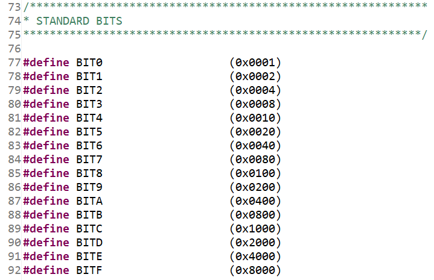{#fig-ch03-3-18}

## Example Application: LED Button Press

Let’s consider an example application. In this example we will use the on-board components of the MSP-EXP430G2ET to create an application that will illuminate the green LED when the right button is pressed. To achieve this, we’ll need to use the GPIO to read the state of the button and set the LED’s state accordingly. Before writing any code, we first need to know the hardware connections. If I want to read and write digital signals to the button and LED, I need to know which GPIO peripherals and pins they are attached to. To know this, I can either consult the schematic found in the MSP-EXP430G2ET user’s guide.

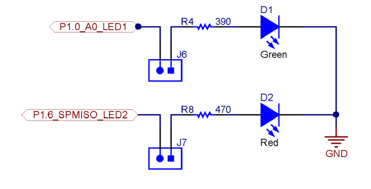{#fig-ch03-3-19}

Figure 3.19 depicts the LED connections taken from the development board schematic. We can see here that the green LED is connected to port 1 pin 0 by recognizing the GPIO abbreviation. A current limiting resistor and jumper are also connected to this pin. Figure 3.20 shows clippings of the schematic with the button connections. SW1 is the button found on the left side of the development board, and we can see that it is connected to port 1 pin 3. Also, from this schematic we can tell that the buttons are connected directly to ground when pressed, which means we’ll need an internal pull-up resistor connected in order to read a digital high voltage when the button is not pressed.

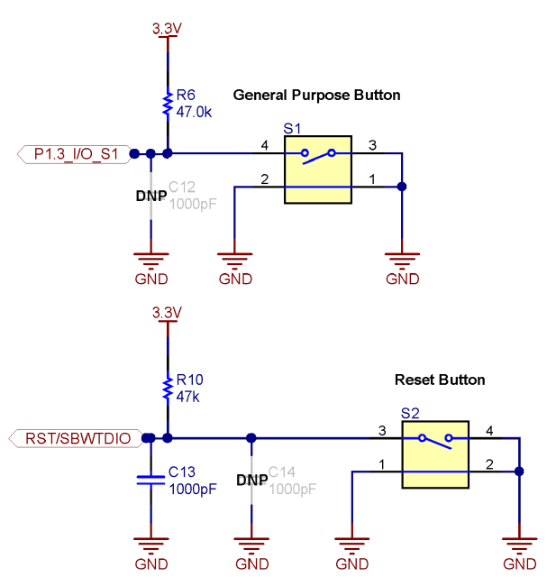{#fig-ch03-3-20}

Now that the connections are known, we can begin writing the code. We’ll use the MSP430 library to access the previously defined register macros and bit definitions.

```c
#include <msp430.h>
```

At the start of main we’ll disable the watchdog timer, clear the GPIO lock, and set the initial control register connections. We need P1.0 configured as an output, and we need P2.3 configured as an input with an internal pull-up resistor.

```c
int main(void)
{
    // Stop the watchdog timer
    WDTCTL = 0x5A80;
    // Button configs
    // Set P1.3 as input (all others as input due to being 0)
    P1DIR &= ~BIT3;
    // Enable P2.3 pull-up resistor
    P1REN |= BIT3;
    // Set P2.3 as high to configure pull-up
    P1OUT |= BIT3;
    // LED configs
    // Set P1.0 as output (all others as input due to being 0)
    P1DIR |= BIT0;
```

Next, we’ll add the infinite while loop. Within this while loop, we will use a bit mask to isolate P2.3 and check if the value is set to 0. If P2OUT is all 0’s after the mask, that means bit 3 was set to 0 by pressing the button, which we will then write a 1 to P1.0 to turn the LED on. Otherwise, we read a 0x08, indicating the button is not pressed, and the pull-up resistor is providing a digital high, and we will write a 0 to P1.0 to turn the LED off.

```c
while(1)
{
    if((P1IN & BIT3) == 0x00){
        // Button pressed, turn LED on
        P1OUT = P1OUT | 0x01;
    } else {
        // Button not pressed, turn LED off
        P1OUT = P1OUT & 0xFE;
    }
}
}
```

This code will run until power is disconnected to the microcontroller, constantly checking the button and setting the LED accordingly.

## Recap

In this chapter we’ve learned:

-   How peripherals are used to interface a microcontroller with another circuit

-   How to control peripherals by writing to control registers

-   How to read and write digital signals using GPIO

-   Using pointers and macros to access control registers

-   Bit masking to isolate individual bits in a register

-   How to create readable bit masking code
