## Learning Objectives

In this chapter we will learn:

-   Functionalizing Code

-   Hardware Abstraction Layers

-   Software State Machines

-   System Clocks

-   Interrupts

## Developing code for embedded Systems

We now have the knowledge to write C code, control the peripheral hardware, and utilize the existing libraries and tools for developing code for embedded systems. However, due to an embedded system’s relationship with the system that it is integrated within, we often have concerns that do not manifest when writing code for a desktop computer. These concerns are often related to the **real-time** nature of an embedded system.

## Functionalizing Code

The most basic aspect of writing clean, bug-free C code is proper functionalization. **Functionalizing** code refers to using functions to group related code segments. Since C isn’t an object-oriented language, we do not have classes or other complex structures to abstract our code, so we must very carefully organize our code into functions.

Most embedded systems programmers will create initialization routines for their programs. Since the peripherals often need to be configured on start-up, and often only once (such as setting a GPIO pin direction), it makes sense to group everything into an initialization routine. That way at the start of the main function, we aren’t bombarded with hundreds of lines of peripheral initialization code. This makes the code much easier to read. Using our example from the end of Chapter 3, let’s look at what an initialization function might look like:

```c
void init(){
    // Stop the watchdog timer
    WDTCTL = 0x5A80;
    // Button configs
    // Set P1.3 as input (all others as input due to being 0)
    P1DIR &= ~BIT3;
    // Enable P2.3 pull-up resistor
    P1REN |= BIT3;
    // Set P2.3 as high to configure pull-up
    P1OUT |= BIT3;
    // LED configs
    // Set P1.0 as output (all others as input due to being 0)
    P1DIR |= BIT0;
}
```

Another goal of functionalizing your code is to create layers of abstraction. Abstraction will hide the details of the underlying hardware so that your function names relate to the application. For instance, if we want to change the state of the green LED on the board, we might create a function such as:

```c
void setGreenLed(bool enable){
    if(enable){
        P1OUT |= BIT0;
    } else {
        P1OUT &= ~BIT0;
    }
}
```

Where the function’s name indicates its purpose, and the details regarding the pin connection of the LED are buried away behind the function. Similarly, we can create a function interface for a push button:

```c
bool isButtonPressed(void){
    if((P1IN & BIT3) == 0x00){
        return true;
    } else {
        return false;
    }
}
```

Note that the “bool” datatype is not a native datatype in the C language, and the \<stdbool.h\> library must be included for this function to compile.

### Advanced Considerations: Inline Functions

It can be difficult to remember which devices are connected to a specific port and pin or understand what a bit masking operation is doing at a glance. Functionalizing code that performs common behaviors, such as setting an LED, greatly increases the code’s readability by assigning the function a name that describes its behavior. Placing code into functions also has the benefit of decreasing our overall compiled code size. Since rather than adding additional instructions in the code at every location where we would like to turn an LED on or off, we reuse the functionalized code over and over.

However, there is a drawback associated with this. When a function is called, it creates a “frame” on the stack. A function’s stack frame contains the functions’ local variables, parameters, and return address. This process takes more time and more memory than if we would have just written the register assignments at the line of code where we wanted to control the LED. This creates a trade-off between slowing down the run time performance or decreasing the code size. This trade-off, however, does not consider the readability of the source code! If I want to functionalize for the sake of readability, but I desire to increase my code size for performance (which would require that I code the register assignments at each line of code where I might change an LED), what could I do?

Fortunately, the C compiler has a solution for this: inline functions. By declaring a function as “inline”, when the code is compiled, everywhere the inline function is called, it will be replaced by the instructions that make up that function, preventing a new stack frame from being created and increasing performance at the expense of compiled code size.

For example, I can make the “setGreenLed” function inline by simply adding the “inline” keyword at the beginning of the function definition before the return type:

```c
inline void setGreenLed(bool enable){
    if(enable){
        P1OUT |= BIT0;
    } else {
        P1OUT &= ~BIT0;
    }
}
```

However, it can be important to note that the inline keyword does not get considered by the linker, so sometimes you may run into trouble compiling inline functions. To resolve this, we can include the static keyword as well. Static functions are only visible to the current file (or “translational unit”, which includes header files). So for functions that provide a simple low-level translation, such as “setGreenLed” above, we would use a static inline function.

```c
Static inline void setGreenLed(bool enable){
    if(enable){
        P1OUT |= BIT0;
    } else {
        P1OUT &= ~BIT0;
    }
}
```

## Hardware Abstraction Layers

Embedded programmers will often take this concept a step further and create what is known as a **hardware abstraction layer** (HAL). A HAL is typically a header file that provides define macros that describe the GPIO connections of a certain component, such as port and pin numbers. For instance, we could create a header file that contains the following define macros for representing the red LED connections:

```c
#define LED_PIN 0
#define LED_DIR_REG P1DIR
#define LED_OUT_REG P1OUT
```

Then, we would use the port and pin numbers here in the functions that perform manipulation of the LED:

```c
void setLed(bool enable){
    if(enable){
        LED_OUT_REG |= 1 << LED_PIN;
    } else {
        LED_OUT_REG &= ~(1 << LED_PIN);
    }
}
```

What this provides us with is flexibility and modularity. Currently, this code will set the green LED, but let’s say some design change came through that required us to use the red LED rather than the green. Now, all I have to change is the port and pin number in the hardware abstraction layer, and all of my code has adapted to that change!

```c
#define LED_PIN 6
#define LED_DIR_REG P6DIR
#define LED_OUT_REG P6OUT
```

HALs can also provide modularity when switching between different microcontrollers as well. If some requirement in the project requires that we switch to a different type of MSP430 with more memory, or some peripheral that was available on the MSP43G2553, then all we have to do is change the HAL to the appropriate new hardware connections and our code instantly adapts.

## Header Files and Source Files

Programs in C are largely organized into two types of files: source files (.c) and header files (.h). So far, all of the code we’ve written has been placed in a “.c” file (usually “main.c”). However, as projects grow in size, it’s not practical to keep all of our code in a single “.c” file.

That’s where header files come in. Header files can be included in the build process and allow us to place our code into other files. We’ve already been using header files, such as “msp430.h” and “stdint.h”, in our projects by “#include”ing them at the top of our “.c” file. Header files can store preprocessor directives (#define, #include, etc.) in the header file to declutter our main “.c” file, but they can also be used to reference functions in separate “.c” files.

When we “#include” a header file in our code, the compiler will essentially “copy and paste” the contents of that header file at the top of the file that included it. For example, let’s say I have a header file called “leds.h” with the following contents:

```c
#define GREEN_LED_PIN 0
#define GREEN_LED_DIR_REG P1DIR
#define GREEN_LED_OUT_REG P1OUT
#define RED_LED_PIN 6
#define RED_LED_DIR_REG P1DIR
#define RED_LED_OUT_REG P1OUT
```

And I have a “main.c” file with the following contents:

```c
#include "leds.h"
void setGreenLedOn(){
    GREEN_LED_OUT_REG |= 1 << GREEN_LED_PIN;
}
void setRedLedOn(){
    RED_LED_OUT_REG |= 1 << RED_LED_PIN;
}
void allLedsOff(){
    GREEN_LED_OUT_REG |= ~(1 << GREEN_LED_PIN);
    RED_LED_OUT_REG |= ~(1 << RED_LED_PIN);
}
void init(){
    // Stop the watchdog timer
    WDTCTL = 0x5A80;
    GREEN_LED_DIR_REG |= 1 << GREEN_LED_PIN;
    RED_LED_DIR_REG |= 1 << RED_LED_PIN;
}
int main(){
    volatile unsigned long int i;
    init();
    while(1){
        setRedLedOn();
        for(i = 0; i < 1000000; i++); // delay
        setGreenLed();
        for(i = 0; i < 1000000; i++); // delay
        allLedsOff();
        for(i = 0; i < 1000000; i++); // delay
    }
}
```

When we compile this “main.c” file, the preprocessor runs first and resolves all lines of code that begin with a “#” sign. First, the “leds.h” header file will be included. After the preprocessor resolves this line, our code would look like the following:

```c
#define GREEN_LED_PIN 0
#define GREEN_LED_DIR_REG P1DIR
#define GREEN_LED_OUT_REG P1OUT
#define RED_LED_PIN 6
#define RED_LED_DIR_REG P1DIR
#define RED_LED_OUT_REG P1OUT
void setGreenLedOn(){
    GREEN_LED_OUT_REG |= 1 << GREEN_LED_PIN;
}
void setRedLedOn(){
    RED_LED_OUT_REG |= 1 << RED_LED_PIN;
}
void allLedsOff(){
    GREEN_LED_OUT_REG |= ~(1 << GREEN_LED_PIN);
    RED_LED_OUT_REG |= ~(1 << RED_LED_PIN);
}
void init(){
    // Stop the watchdog timer
    WDTCTL = 0x5A80;
    GREEN_LED_DIR_REG |= 1 << GREEN_LED_PIN;
    RED_LED_DIR_REG |= 1 << RED_LED_PIN;
}
int main(){
    volatile unsigned long int i;
    init();
    while(1){
        setRedLedOn();
        for(i = 0; i < 1000000; i++); // delay
        setGreenLed();
        for(i = 0; i < 1000000; i++); // delay
        allLedsOff();
        for(i = 0; i < 1000000; i++); // delay
    }
}
```

Notice that the “#include “leds.h”” has been replaced by the contents of “leds.h”. Next, the preprocessor would resolve all of the #define lines that have been included.

```c
void setGreenLedOn(){
    P1OUT |= 1 << 0;
}
void setRedLedOn(){
    P1OUT |= 6;
}
void allLedsOff(){
    P1OUT |= ~(1 << 0);
    P1OUT |= ~(1 << 6);
}
void init(){
    // Stop the watchdog timer
    WDTCTL = 0x5A80;
    P1DIR |= 1 << 0;
    P1DIR |= 1 << 1;
}
int main(){
    volatile unsigned long int i;
    init();
    while(1){
        setRedLedOn();
        for(i = 0; i < 1000000; i++); // delay
        setGreenLed();
        for(i = 0; i < 1000000; i++); // delay
        allLedsOff();
        for(i = 0; i < 1000000; i++); // delay
    }
}
```

We can see that all references to “GREEN_LED_PIN”, “GREEN_LED_OUT_REG”, etc., have been replaced by the value that they were macro’d to (ex., all instance of “RED_LED_PIN” have been replaced by “6”, since the line was originally “#define RED_LED_PIN 6”). Now, this still isn’t a complete example, as “P1OUT” still needs to be replaced by the macros found in \<msp430.h\>.

## Software State Machines

Another common method of abstraction in embedded systems is the usage of state machines. A state machine is a program or machine that organizes its functionality into different “states”. The machine will then transition between the states as it receives inputs from sensors or users. Almost any problem can be organized into a state machine, which helps abstract complex problems by dividing them up into finite states which are easier to define.

Let’s consider a simple example application where a microcontroller turns an LED on or off based on a button press. If we wanted to organize this application into a state machine, we would want to consider the behaviors of this application and how we can organize them into states, which are the system’s behaviors. In this simple application, we can easily identify two behaviors: turning the LED on and turning the LED off. We would organize these two behaviors into separate states, then we would need to describe how the system moves between states. The button press is to turn the LED on or off, so we would draw arrows indicating the transitions between states with a label indicating what caused that transition. This example state machine can be seen in the diagram of Figure 4.1.

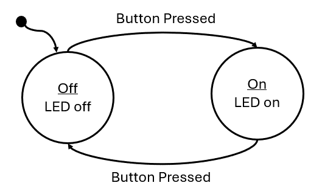{#fig-ch04-4-1}

### Anatomy of a State Machine

There are several important components that need to be present in every state diagram, such as the one in Figure 4.1:

-   States – A circle or box containing the state label and the behavior (outputs and actions) the state. Sometimes if the behavior of the state is too complex, it will be omitted and described elsewhere.

-   Transitions – An arrow indicating when to transition from one state to another. These arrows will also include the condition the prompts the transition.

-   Initial State – A dot with an arrow is drawn on the diagram to indicate which state is the initial state.

### Implementing a Software State Machine

Once diagrammed, software state machines are easy to implement. Ultimately, the behavior of each state simply needs to be grouped together with some branching conditions to separate them based on a variable which represents the current state. In C, this can be done with a series of “if-else” statements, but more commonly the switch statement is used. Switch statements are easier to read for many different states. For example, a state machine can simply be represented with the following:

```c
while(1){
    int state = 0;
    switch(state){
        case 0:
        // some behavior for state 0
        if(/* transition condition */){
            state = 1;
        }
        break;
        case 1:
        // some behavior for state 1
        if(/* transition condition */){
            state = 2;
            else if(/* transition condition*/) {
                state = 0;
            }
            break;
            case 2:
            // some behavior for state 1
            if(/* transition condition */){
                state = 2;
                else if(/* transition condition*/) {
                    state = 0;
                }
                break;
                default:
                // catch potential errors here
                break;
            }
        }
```

Where the variable, state, contains a numeric value that represents the current state. Each iteration of the while loop will run the current state, whose behavior is selected by the switch condition. At the end of each state, some condition will be tested to determine if the state will transition to a new state or run the same state again.

In this template code example, the behavior of each state is represented with just a comment, as the state’s behavior is dependent on whatever the application is supposed to do. These behaviors can be quite long, so in order to keep the state machine readable, it is common to functionalize the state’s behavior. When functionalized, the behavior is neatly organized and the next state the machine should transition to can be returned by that function:

```c
while(1){
    int state = 0;
    switch(state){
        case 0:
        state = runState0(/* pass state inputs */);
        break;
        case 1:
        state = runState1(/* pass state inputs */);
        break;
        case 2:
        state = runState2(/* pass state inputs */);
        break;
        default:
        // catch potential errors here
        break;
    }
}
```

With the functionalized structure, no matter how complex the state’s behaviors become, this template will not change as all the complexity is hidden behind the functions.

### Example: Traffic Light

As a simple example, we’ll implement a traffic light using the MSP430G2553 using a state machine to model the behavior. To begin, we’ll present the circuit diagram for the traffic light. We’ll use three LEDs to represent each color on the traffic light! How each of these LEDs are interfaced to GPIO pins of the microcontroller is shown in Figure 4.2.

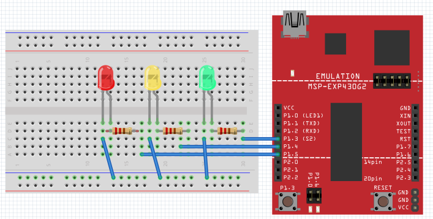{width="6.293055555555555in" height="3.1868055555555554in"}

Figure 4.2: Traffic light schematic diagram

In Figure 4.2, we can observe that we have connected the green, yellow, and red LEDs to P1.3, P1.4, and P1.5, respectively. To create the traffic light behavior, we will organize the behavior into induvial states that control the output (the LED that should be illuminated) based on inputs (the amount of time that should each color should be illuminated for) and transition conditions (when the lights should change colors).

#### Creating Interface Functions

We will create functions for initializing and manipulating the LEDs, which will be set by the current state:

```c
static inline void setGreenLed(bool enable){
    if(enable){
        P1OUT |= BIT3;
    } else {
        P1OUT &= ~BIT3;
    }
}
static inline void setYellowLed(bool enable){
    if(enable){
        P1OUT |= BIT4;
    } else {
        P1OUT &= ~BIT4;
    }
}
static inline void setRedLed(bool enable){
    if(enable){
        P1OUT |= BIT5;
    } else {
        P1OUT &= ~BIT5;
    }
}
void init(){
    // Stop the watchdog timer
    WDTCTL = WDTPW | WDTHOLD;
    // LED configs
    P1DIR |= BIT3 | BIT4 | BIT5;
}
```

#### Capturing Behavior with a State Diagram

Before creating a state machine, we first need to model its behavior using a state diagram. Now that we have the functions needed for manipulating our traffic light, we need to create a state diagram to describe the behavior of the traffic light. This diagram can be seen in Figure 4.3.

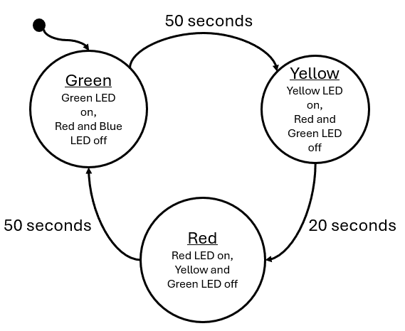{width="5.1194444444444445in" height="4.1930555555555555in"}

Figure 4.3: Traffic light state diagram

The outputs of this state are simply the illuminated LED and the input to the state machine is time in seconds. Every 50 seconds, the green state will transition to the yellow state, after 30 seconds the yellow will transition to red, and after 50 seconds red will transition back to green. We can see that the input to this system is real-world seconds, we need some way to create a function that will give us a delay in seconds.

#### Building Delay Functions

To build a delay function to stall the processor, we can use the MSP430’s built-in \_\_delay_cycles() function. This is a function that will insert “no-ops” (no operation) instructions into the processor. As its name implies, a no-op does nothing but wastes time as it moves through the processor – perfect for creating delays. What we must understand now is: how much time is wasted with a single no-op? The MSP430 completes one instruction each clock cycle. The clock is an oscillating square-wave signal which provides synchronization for digital circuits. If one instruction is completed each clock cycle, then each no-op will take the same amount of time as the period of the clock signal. In the MSP430G2553 documentation, we can learn that by default, the processor clock speed is 1 MHz, so 1,000,000 cycles per second. Therefore, each instruction takes 0.000001 seconds to execute.

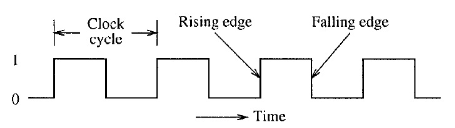{width="6.293055555555555in" height="1.7715277777777778in"}

Figure 4.4: Clock period

Using this information, we can create a delay function that consumes as many seconds as we desire, by passing 1,000,000 to the \_\_delay_cycles() function.

```c
void delay_s(uint16_t seconds){
    volatile uint16_t i;
    for(i = 0; i < seconds; i++){
        __delay_cycles(1000000);
    }
}
```

We can use this to create a delay that will increment our state machine’s input value in seconds.

#### Creating State Functions

We now have everything we need to implement the traffic light diagram in 4.3: functions to set the LEDs and a function to create a delay in seconds. All we have to do next is create the state machine itself. We will begin by creating the functions that will represent our states:

```c
uint16_t runRedState(uint16_t* seconds){
    uint16_t nextState = 2;
    // set output
    setRedLed(true);
    setGreenLed(false);
    setYellowLed(false);
    // next state logic
    if(*seconds > 50){
        *seconds = 0;
        nextState = 0;
    }
    return nextState;
}
uint16_t runYellowState(uint16_t* seconds){
    uint16_t nextState = 1;
    // set output
    setRedLed(false);
    setGreenLed(false);
    setYellowLed(true);
    // next state logic
    if(*seconds > 20){
        *seconds = 0;
        nextState = 2;
    }
    return nextState;
}
uint16_t runGreenState(uint16_t* seconds){
    uint16_t nextState = 0;
    // set output
    setGreenLed(true);
    setRedLed(false);
    setYellowLed(false);
    // next state logic
    if(*seconds > 50){
        *seconds = 0;
        nextState = 1;
    }
    return nextState;
}
```

Note that these functions are constructed in the same functionalized format presented in the previous section: each function contains the behavior of the state, each function is passed the state inputs, and returns what the next state should be on the following iteration based on the current inputs.

#### Implementing the State Machine

Next, we will construct the state machine within our main function and while(1) loop:

```c
int main(void) {
    uint16_t seconds = 0;
    uint16_t currentState = 0;
    uint16_t nextState = currentState;
    init();
    while(1) {
        switch(currentState){
            case 0: // Green State
            nextState = runGreenState(&seconds);
            break;
            case 1: // Yellow State
            nextState = runYellowState(&seconds);
            break;
            case 2: // Red State
            nextState = runRedState(&seconds);
            break;
            default:
            break;
        }
        // Update state
        currentState = nextState;
        // Update seconds
        delay_s(1);
        seconds++;
    }
}
```

Note that we use two variables for tracking the state each iteration: currentState and nextState. Each loop, currentState is what the switch statement selects, but is updated with nextState by the end of the loop. The nextState variable is updated by the return from each state function call. Our inputs to each state are tracked by a seconds variable that is incremented after a 1 second delay each iteration.

#### Enumerating States

While the implementation we just described is a complete solution, there are several improvements that can be mode. The first aspect that can be improved is the usage of an integer to represent the states. Rather than using an integer, we can create an enumeration to represent the states:

```c
enum{
    GREEN, YELLOW, RED
} state;
```

The enum keyword will enumerate the values encapsulated by the following curly braces. GREEN will take on the value of 0, Yellow will take on 1, and RED will take on 2; The same integer values we had used prior. However, with the usage of the enum will allow us to use these terms rather than the integer values of the states. We can also use enum as a custom datatype by including the keyword “typedef”.

```c
typedef enum{
    GREEN, YELLOW, RED
} state_t;
```

The rest of the state machine can be updated as such:

```c
int main(void) {
    volatile uint16_t seconds = 0;
    state_t currentState = 0;
    state_t nextState = currentState;
    init();
    while(1) {
        switch(currentState){
            case GREEN:
            nextState = runGreenState(&seconds);
            break;
            case YELLOW:
            nextState = runYellowState(&seconds);
            break;
            case RED:
            nextState = runRedState(&seconds);
            break;
            default:
            break;
        }
        // Update state
        currentState = nextState;
        // Update seconds
        delay_s(1);
        seconds++;
    }
}
```

In the same way, the state functions can also be updated:

```c
state_t runGreenState(uint16_t seconds){
    state_t nextState = GREEN;
    // set output
    setGreenLed(true);
    setRedLed(false);
    setYellowLed(false);
    // next state logic
    if(*seconds > 50){
        *seconds = 0;
        nextState = YELLOW;
    }
    return nextState;
}
```

With this improvement, the code becomes much easier to read and write, as the programmer no longer needs to remember which integer value is associated with each state. By using the enum as a custom datatype, it becomes more clear when we are evaluating or returning a state rather than an integer value.

#### Function Tables

Another improvement that can be made is utilization of a function table. A function table is an array of pointers to functions. A function table has the following structure:

```c
(int) *(func_table[3])(int, int) = {func0, func1, func2};
```

Where func0, func1, and func2 have the following prototypes:

```c
int func0(int a, int b);
int func1(int a, int b);
int func2(int a, int b);
```

We can observe that each of these functions have the same parameters and return types, which is required if we are to point to each of these in a function table. Function tables can only hold with identical parameters and return types. We can see the function table is the array named “func_table” which is declared with three indices. The table is dereferenced with the “\*” keyword, preceded by the return type in parenthesis, and followed by the parameter types in parenthesis. In this example, the table is initialized by declaring the function names within curly braces.

To use a function table, we simply call it like any other function with the addition of the index contained within brackets:

```c
int x = func_table[1](5, 10);
```

In this example, we index element 1 of the function table, therefore calling func1 and passing it 5 and 10 as integer parameters. The integer result of the function is returned and stored in x.

We can create a function table to store our state functions:

```c
state_t (*state_table[3])(uint16_t*) = {runGreenState, runYellowState, runRedState};
```

Then, inside the main loop, we can simply use our “currentState” variable to index the correct state function:

```c
while(1) {
    nextState = state_table[currentState](&seconds);
    // Update state
    currentState = nextState;
    // Update seconds
    delay_s(1);
    seconds++;
}
```

Since the state enum values correlate to integers, as long as the sequence of states listed in the enum matches the sequence they are listed in the state table, the correct state will be called from the state table based on the currentState enum value as the index.

However, using a state table can introduce some new hazards that must be accounted for, such as the potential to call a function from an index not in the table (e.g., calling index 4 from an array/function table with only 3 elements). This needs to be checked for in the while loop to ensure that the index is within range of the state table. This is usually managed by adding an additional enum to the state enumeration which indicates the maximum index:

```c
typedef enum{
    GREEN, YELLOW, RED, MAX_STATES
} state_t;
```

The MAX_STATES value will take on the number of states that precede it. In this case, MAX_STATES will be assigned the value of 3, which is the number of states in our state machine, and therefore the number of indices in the state table. We can update the rest of the code to utilize this value:

```c
state_t (*state_table[MAX_STATES])(uint16_t*) = {runGreenState, runYellowState, runRedState};
while(1) {
    if(currentState < MAX_STATES)
    nextState = state_table[currentState](&seconds);
    // Update state
    currentState = nextState;
    // Update seconds
    delay_s(1);
    seconds++;
}
```

Now if we add additional states, only the enum and the state table need to be updated, as the length of the array and the if condition guarding the function table call are all controlled by the MAX_STATES enum value.

## Clock Sources and Signals

When we created the delay function earlier in this chapter, we created a delay using knowledge of the clock frequency. It was stated that from the documentation we knew that the default clock speed was 1 MHz. To be able to derive this information from the documentation, we need to understand how clocking works in the MSP430G2553, but also how it works in general for most microcontrollers.

Microcontrollers very commonly have multiple clocks. This is because the microcontroller might have different timing requirements for various aspects of the systems in which they are integrated. For instance, the system clock may need to run at a fast speed for processing requirements, while the analog to digital converter peripheral might need to sample a signal at a slower rate. While it’s possible to have one clock be able to control all of these aspects, often many clocks are made available for better flexibility and precision.

The MSP430G2553 has multiple clock sources. A clock source is where the oscillation that drives the clock signals originates. These sources are given names associated with what generates them:

-   DCOCLK – internal digitally controlled oscillator

-   VLOCLK – Very low power, low-frequency oscillator with a \~12kHz operating frequency

-   LFXT1CLK – Low-frequency / high-frequency oscillator that can be used with low-frequency watch crystals or external clock sources of 32768 Hz or with standard resonators in the 400-kHz to 16-MHz range

Each of these clock sources have different ranges and are designed for specific purposes. These clock sources can then be configured to be connected to various clock signals. Clock signals refer to the internal circuitry that carries and connects the clock sources to different peripherals and components.

-   MCLK – Main clock, which drives the processor

-   SMCLK – Subsystem main clock, which can be used to drive peripherals

-   ACLK – Auxiliary clock, which also is used to drive peripherals

Clock signals must be configured to be driven by a clock source, as shown in Figure 4.5. Once a clock signal has been assigned a source, it can then be configured to drive the processor or some other peripheral.

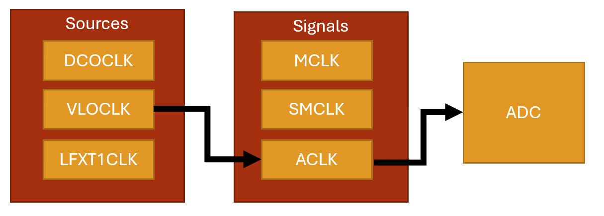{width="6.293055555555555in" height="2.2631944444444443in"}

Figure 4.5: Clock sources and signals

The clocking system is configured through the use of control registers, just as peripherals are. Except this time, we will observe that the control registers bits don’t correspond to enabling features on pins, but rather individual bits and bit ranges will be responsible for enabling, disabling, or selecting different features and settings for the system.

### Example: Using the VLO Clock Source

When writing embedded applications that has strict timing requirements, which is in general most applications, we will often utilize the clocking system to configure the system and peripheral clocks ourselves, so we know exactly which clock rates are being specified. Using the MSP-EXP430G2ET, we’ll create an initialization function for the clock to configure the main clock signal to utilize a specific clock source.

In this example, we will change the main clock signal from its default 1 MHz supplied by the DCO clock source to a 12 kHz VLO clock source. To change the clock source, we must configure a few registers: BCSCTL2, BCSCTL3, and IFG1.

##### BSCTL3

The BCSCTL3 (Basic Clock Module Control Register 3) configures frequency range, low frequency clock select, capacitor values, and also contains fault flags. According to Figure X, we will need to write 0b10 to bits 5-4 of this register to select VLOCLOCK as the low frequency oscillator (LFXT1CLK) clock source. This clock source can be configured to be driven by internal clock sources such as the VLO, but it can also be configured to utilize an external clock source, such as a quartz crystal oscillator, provided one was attached to specific pins on the microcontroller. External oscillators also depend on external capacitors, which is why this same register has options for configuring them. This register also specifies the frequency range of an external oscillator, but since we aren’t using one, we can ignore this configuration as well.

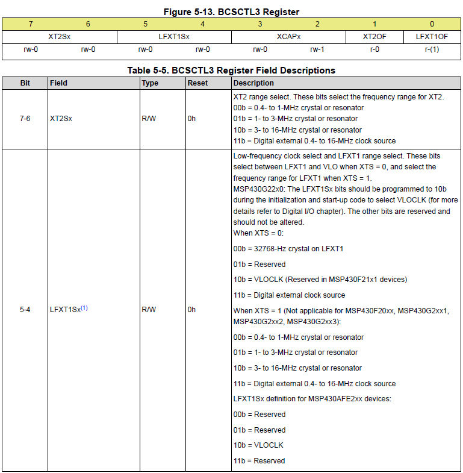{width="5.882507655293089in" height="6.004589895013123in"}

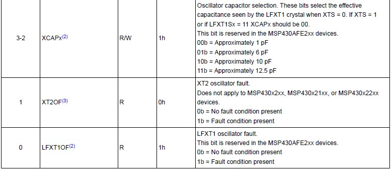{width="5.828356299212598in" height="2.531494969378828in"}

Table 4.1: The BCSCTL3 Register

##### IFG1

When we configure a new clock source in BCSCTL3, a fault will be generated, and we won’t be able to use this clock until we clear it. The IFG1 register has a single bit at position 1 that will flag oscillator faults. We simply write a 0 to the bit 1 position in this register to clear it before doing any other configurations.

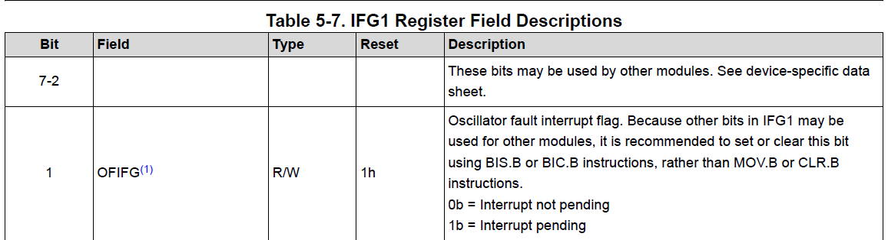{width="6.293055555555555in" height="1.5069553805774278in"}

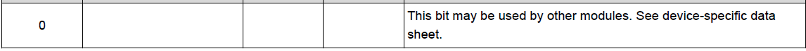{width="6.293055555555555in" height="0.40625in"}

Table 4.2: Select Bits of the IFG1 Register

##### BCSCTL2

The BCSCTL2 (Basic Clock Module Control Register 2) configures which clock sources drive which clock signals. The clock that drives our microcontroller’s processor is the MCLK. We want to write 0b11 to bits 7-6 in this register to set the MCLK to be sourced by the VLOCLK, as seen in Table 4.3. The rest of the bits in this register configure other clock signal sources and select clock dividers, which can be used to slow down a clock signal. Since we are not configuring any other clocks or dividers, we’ll ignore the rest and leave them at their default values.

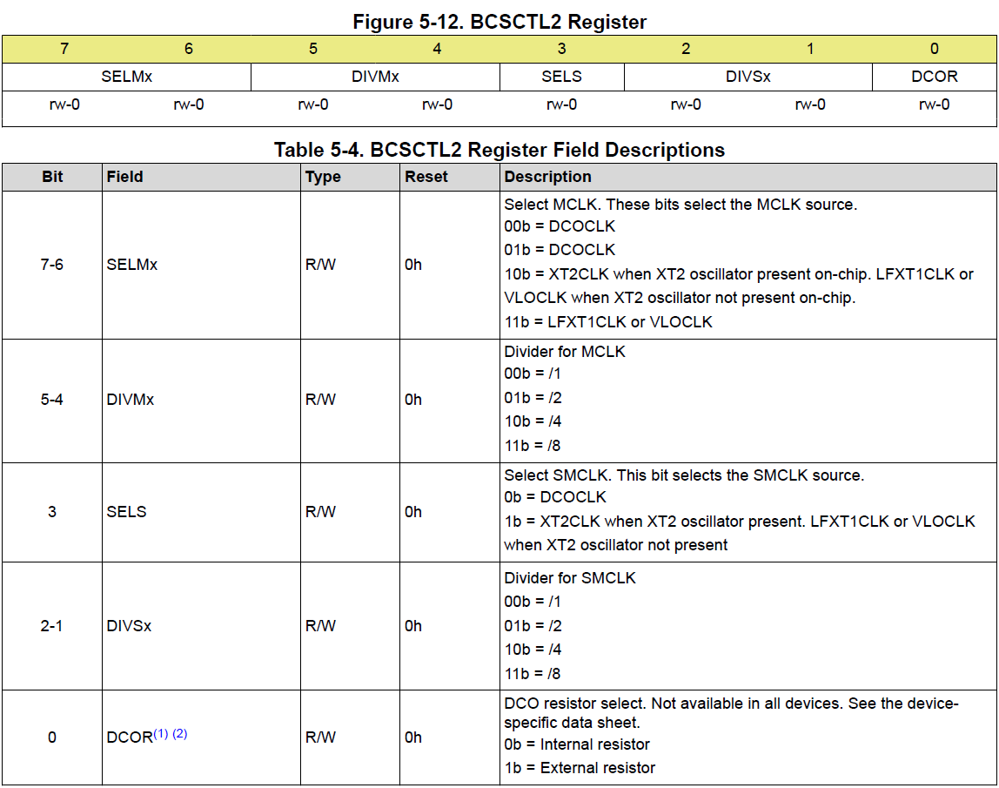{width="6.388089457567804in" height="5.035968941382327in"}

Table 4.3: Select Bits of the BCSCTL2 Register

##### Writing the Code

In many embedded projects, it is common practice to include a clock initialization routine that configures all the clock signals and sources initially, so for timing purposes we have full control and knowledge of the system’s clock speeds. Here we’ll write a function that initializes the main clock (MCLK) signal using the VLO oscillator as the clock source using the configuration just described in the sections above.

```c
void initClocks(){
    BCSCTL3 |= 0b00100000; // Set VLOCLK to LFXT1
    IFG1 &= ~0b00000010; // Clear OSCFault flag
    BCSCTL2 |= 0b11000000; // Set MCLK to VLOCLK or LFXT1CLK
}
```

This provides the configurations needed, however, it is largely unreadable code, unless for some reason you have memorized all the bits in each register and what options they control. We can help alleviate this by utilizing bit macros provided in the \<msp430.h\> library. We have previously seen that this library provides bit macros for various bit masks, such as BIT1 or BIT6, but it also will provide specific bit masks for setting configurations in specific registers. For example, this library provides the following macro:

```c
**#define** LFXT1S_2 (0x20) /* Mode 2 for LFXT1 : VLO */
```

Which sets 0b11 in the 5-4 bit positions for selecting the VLO clock as the LFXT1 source. Ultimately, our function could be re-written using these macros and appear as follows:

```c
void initClocks(){
    BCSCTL3 |= LFXT1S_2; // LFXT1 = VLO
    IFG1 &= ~OFIFG; // Clear OSCFault flag
    BCSCTL2 |= SELM_3 | DIVM_0; // MCLK = LFXT1/1
}
```

It may be debatable whether this is truly more readable than the previous function, but most embedded systems programmers would agree that it is. There is one aspect of this code that is particularly interesting, which is the use of logical or with the DIVM_0 macro. The DIVM_0 macro appears as follows in the \<msp430.h\> header file:

```c
**#define** DIVM_0 (0x00) /* MCLK Divider 0: /1 */
```

We see that it is macro’d to 0 to select a clock division of 1, which is correct because we wanted to use the 12 kHz with no division in this example. Therefore, this bit mask does *absolutely nothing* to bits assigned to this register! So why would we bother including this? It may not do anything to the data assigned to the register, but it does *communicate* to other programmers that it was intended to use a clock divider of 1 in this initialization routine. Seeing as this functionally does nothing, the compiler will optimize this operation away, so including it doesn’t decrease our program’s execution time anyways.

## Interrupts

Now that the problem of creating a delay for a specific period of time has been solved, a new problem has been introduced. While we are in the delay function, we can no longer be reactive to any external events, such as button press es. If the user presses the button and releases it while we are in the middle of a long delay function, we will have no way to detect that button press! Figure 4.7 illustrates this condition with a diagram.

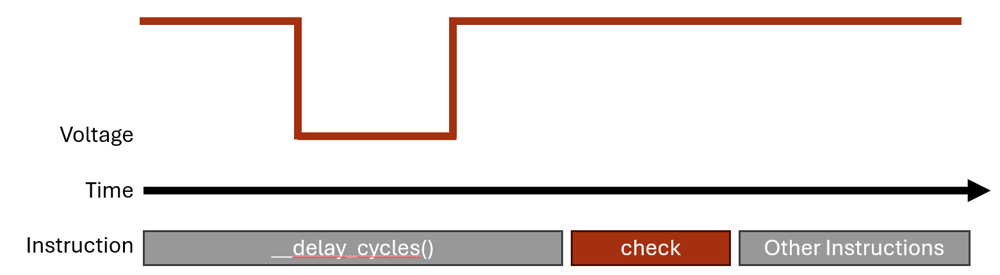{width="6.293055555555555in" height="1.7333333333333334in"}

Figure 4.7: Missing a button press while in a delay function

We need some way to instantly react to events that occur at real time in an embedded system. These events can come from user interaction through buttons or switches, but they can also come from external sensors or even conditions in the program. Whatever the source of the event, we often cannot predict when these events will occur, so we need the ability to pause whatever the program is doing and handle the event. The way we achieve this in almost every processor architecture is through “interrupts”.

Interrupts are triggered by random, external events and they allow us to pause the computer’s program execution and temporarily run some other code to handle the event. The code we call to handle the event is known as the **interrupt handler** or also the **interrupt service routine (ISR)**. Once the ISR has concluded, the program will pick back up where it left off before the interrupt occurred.

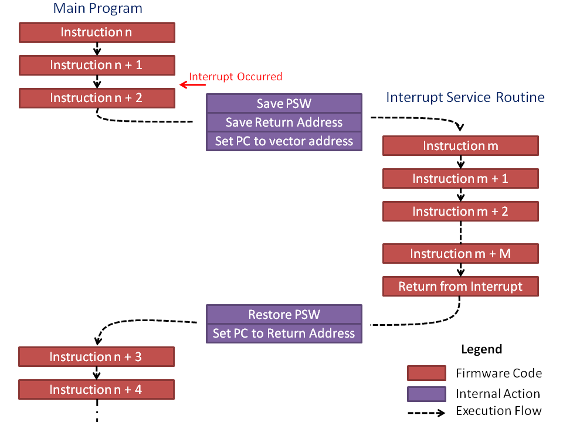{width="5.3893285214348206in" height="4.041666666666667in"}

Figure 4.8: Pausing the code to handle the interrupt

##### How Interrupts Work

An interrupt is triggered by an event that the hardware acknowledges. The hardware will save the current state of the processor (what line of code it was executing at the time and various other conditions and properties) then jump to a memory location that will lead to a user-defined function.

There are two ways interrupts are implemented: vectored and non-vectored. We’ll start by discussing the vectored implementation, as it is the method used in our MSP430 microcontroller. In vectored interrupts, a section of memory is blocked off to serve as the interrupt vector table. The table has a start address, and from that address are indexed memory locations associated with each interrupt source. Each of these indexed memory locations can be filled with the address of the function that will be called when the interrupt event occurs (the interrupt service routine!).

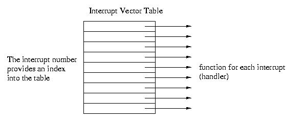{width="5.176140638670166in" height="2.04957239720035in"}

Figure 4.9: Interrupt Vector Table

For instance, say we have an interrupt that triggers when a button is pressed (the voltage on one of the GPIO changes from a 1 to a 0). This hardware event may be associated with, say, index 45 of the interrupt vector table. The processor will pause, retrieve the address of the ISR at memory location *\<vector table base address\> + 45*, then start executing the code at that function’s memory location.

Non-vectored interrupts function in a similar way but have less hardware support. When an interrupt trigger occurs, the processor will pause and then go to a single interrupt ISR which will then determine in the software what type of event occurred and what function to call. This eliminates the need for a dedicated vector table in the microcontroller’s memory map, but it also is a little slower to access the ISR because it has to run additional lines of code. In vectored interrupts, the interrupt condition has a known memory location where it’s ISR address is stored, and it will jump to that location without any prior computations.

### Example: Traffic Light Crosswalk Button

Let’s say we wish to add a crosswalk button to our traffic light state machine. The crosswalk button should add an additional state to the application which sets the red light and a blue light which represents a “walk sign” that gives time for pedestrians to cross the street. This blue LED is connected to P2.0 as seen in the schematic in Figure 4.10.

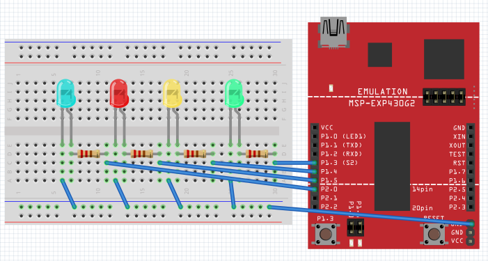{width="6.293055555555555in" height="3.3663812335958005in"}

Figure 4.10: Schematic including additional blue LED to represent the crosswalk light

We’ll use the button attached to P1.X as our crosswalk request button. If the crosswalk request button is pressed at any time, it will cause the state machine to transition to a crosswalk state after the next yellow light, then transition to the red light state after the crosswalk state ends. The updated state machine diagram is shown in Figure 4.11.

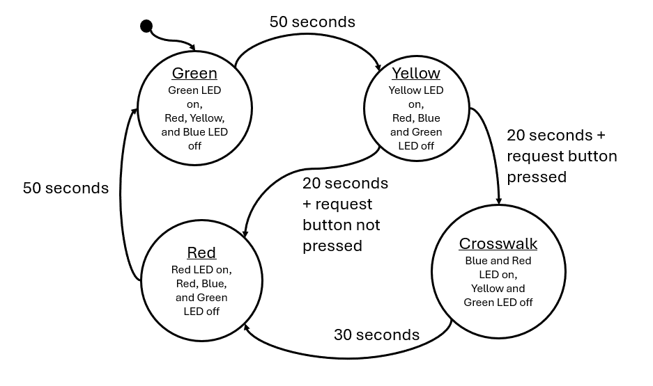{width="6.293055555555555in" height="3.7270833333333333in"}

Figure 4.11: Traffic Light with Crosswalk State Machine Diagram

Since our state machine depends on one second delays, it is possible that the user presses the button and releases it during the delay period. In order to catch this button press, we will want to attach it to an interrupt that will acknowledge the button press no matter where we are during the code’s execution.

Interrupts are usually configured through the associated peripheral’s registers. For GPIO, we can enable interrupts using registers that enable various interrupt conditions. For GPIO, each port has several registers that enable and configure the interrupt conditions.

##### PxIE

The first register is the PxIE register, which enables interrupts on the pins 0 through 7 of the port. For example, writing a 1 to bit 3 in this register will enable an interrupt on pin 3 of the GPIO port. Conversely, writing a 0 to bit 3 will disable the interrupt on pin 3. This register’s description from the user’s manual can be found in Figure 4.11.

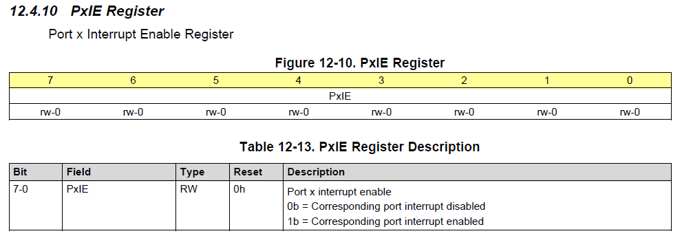{width="6.293055555555555in" height="2.196527777777778in"}

Figure 4.11: The PxIE register

##### PxIES

The next register is the PxIES register. This register selects the interrupt source. Interrupts are often triggered by various conditions related to the peripheral that’s generating them. In the case of GPIO, interrupts can be configured to trigger when the voltage on the pin transitions from a digital high to digital low voltage, or vice versa. The PxIES register allows us to select which condition we want an individual pin to generate an interrupt. For example, writing a 1 to bit 3 of this register will enable high-to-low interrupts on pin 3, and writing a 0 to bit 3 will enable low-to-high interrupts on pin 3. This register’s description from the user’s manual can be found in Figure 4.12.

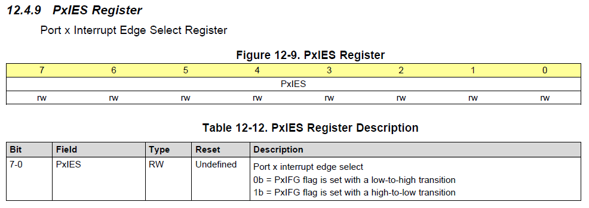{width="6.293055555555555in" height="2.2270833333333333in"}

Figure 4.12: The PxIES register

With these two registers, we can configure an interrupt on a GPIO pin. In our example, we want an interrupt to be triggered anytime a button is pressed. We have a button that is connected to ground on P2.3, so we’ll configure this button with a pull-up resistor and a falling-edge triggered interrupt. That way, when the user presses the button, it will go from a digital high voltage provided by the pull-up resistor to a digital low voltage when the button connects to ground. Initialization of this register may look like the following:

```c
// Button Configuration (P2.3 as input with pull-up resistor)
P2DIR &= ~BIT3;
P2REN |= BIT3;
P2OUT |= BIT3;
// Enable high-to-low interrupts on P2.3
P2IES |= BIT3;
P2IE |= BIT3;
// Enable global interrupts
__enable_interrupt();
```

An interesting point regarding this code example is the “\_\_enable_interrupt" line. This function is an internal compiler function for the MSP430 that enables all interrupts. Very commonly, microcontrollers will include a way to globally enable or disable interrupts. This feature exists so that if you have some important chunk of code that needs to execute without the possibility of a random interrupt breaking it’s flow, you can turn off all interrupts prior (using “\_\_disable_interrupt()”) and then enable them when you’re done. By default, global interrupts are disabled, so we need to turn them on before using them!

Now that we’ve configured the interrupt, how do we use an interrupt service routine? For the MSP430 compiler, we have to define a function and then associate it with the interrupt condition we want it to be called from. An example interrupt for reading a button press may appear as follows:

```c
#pragma vector=PORT2_VECTOR
__interrupt void Port2_ISR(){
    buttonPressed = true;
    // Clear bit3 flag
    P2IFG &= ~BIT3;
}
```

This function has a lot of new things, so let’s take each aspect of the function bit by bit. First of all, notice that **the function takes no parameters and returns void**. This is true for all interrupt service routines. Since they are called when an event occurs, they can’t pass data and they can’t return data; all due to the unpredictability of when they might be called. The only way to get data in and out of an ISR is through global variables. In this example, “buttonPressed” is a global Boolean variable that is set by the ISR. This data will be evaluated later in the main loop.

The next item to note is the #pragma line. Since this line of code begins with a hash symbol, that indicates that it is a preprocessor directive. The #pragma directive provides additional information not the compiler beyond what is contained with the language itself. The pragma directive can be used to force dependencies or throw custom warnings and errors when compiling. For this specific MSP430 compiler, it’s being used to associate the following function with its position within the interrupt vector table. The MSP430 compiler understands that “vector=PORT2_VECTOR” as an association with interrupts generated by the GPIO Port2 peripheral. This also means that if we had multiple interrupts on port 2, they would all have to share this same interrupt service routine.

Preceding the function return type we see the line “\_\_interrupt”. Again, this is a compiler-specific keyword that simply indicates that the following function is an interrupt service routine.

Finally, the line of code “P2IFG &= \~BIT3”. This line of code is clearing a flag bit that is set by the interrupt hardware. Many microcontrollers will include a flag register that will set bits that indicate the source of the interrupt. This register needs to be cleared at the end of each ISR call – otherwise, it will re-trigger the interrupt service routine, creating an infinite loop!

##### PxIFG

This PxIFG register is the “Port X Interrupt Flag” Register. When an interrupt is triggered on any pin on Port X, it’s corresponding bit in the PxIFG register will be set. For example, if I have configured Port 2 Pin 3 to trigger an interrupt, if a signal occurs on that pin that would generate an interrupt, the P2IFG register would have bit 3 set.

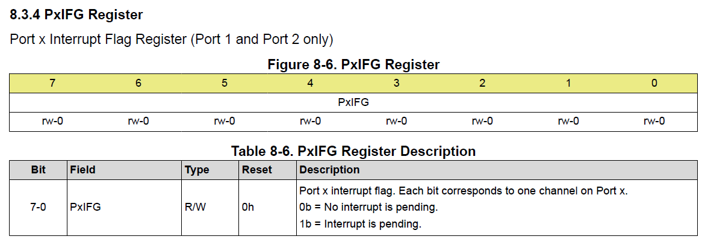{width="6.293055555555555in" height="2.160416666666667in"}

Figure 4.13: The PxIFG register

This register’s purpose allows us to determine which pin called the interrupt. For instance, let’s say that Port 2 Pin 2 was also configured to generate an interrupt. Since all pins on Port 2 share an ISR, when the ISR is called, how can we tell which pin was responsible? This register is how! If I check the P2IFG register during the call and observe that only pin 2 is set and pin 3 is not, then I will know that pin 2 made the call. This is important for situations where we might have 2 buttons configured on the port. We might want each button to trigger different tasks (e.g., one starts a timer on a stopwatch and another resets it). This way, when the button is pressed, we can use P2IFG inside of an “if” statement within the ISR to select different actions based on which pin triggered the interrupt.

Additionally, this pin should be cleared before exiting the routine. If it is not, the hardware will cause the ISR to be called again. If any of the bits in this register are set, the ISR will be called. So therefore, after performing whatever operations we want during the ISR, we should write a 0 back to the bit that called the ISR. In our traffic light example, we see the inverse bit mask being applied to the P2IFG register before exiting the routine.

##### Updating the State Machine

Finally, we would write a new function for the crosswalk state and include it in our state machine.

```c
state_t runCrosswalkState(uint16_t seconds){
    state_t nextState = CROSSWALK;
    // set output
    setGreenLed(false);
    setRedLed(true);
    setYellowLed(false);
    setBlueLed(true);
    // next state logic
    if(*seconds > 30){
        *seconds = 0;
        nextState = RED;
    }
    return nextState;
}
```

In addition to creating a new state for the crosswalk, we’ll need to update the other states to include controls for the blue LED we added for the crosswalk and the yellow state needs to include logic to transition to either the red or crosswalk state (by evaluating the “buttonPressed” global variable) after 20 seconds:

```c
uint16_t runRedState(uint16_t* seconds){
    state_t nextState = RED;
    // set output
    setRedLed(true);
    setGreenLed(false);
    setYellowLed(false);
    setBlueLed(false);
    // next state logic
    if(*seconds > 50){
        *seconds = 0;
        nextState = GREEN;
    }
    return nextState;
}
uint16_t runYellowState(uint16_t* seconds){
    state_t nextState = YELLOW;
    // set output
    setRedLed(false);
    setGreenLed(false);
    setYellowLed(true);
    // next state logic
    if(*seconds > 20){
        *seconds = 0;
        if(buttonPressed){
            buttonPressed = 0; // clear button flag
            nextState = CROSSWALK;
        } else {
            nextState = RED;
        }
    }
    return nextState;
}
uint16_t runGreenState(uint16_t* seconds){
    state_t nextState = GREEN;
    // set output
    setGreenLed(true);
    setRedLed(false);
    setYellowLed(false);
    setBlueLed(false);
    // next state logic
    if(*seconds > 50){
        *seconds = 0;
        nextState = YELLOW;
    }
    return nextState;
}
```

Additionally, we want to include the crosswalk state in the enumeration, so it can be called by the state table in our main loop:

```c
typedef enum{
    GREEN, YELLOW, RED, CROSSWALK, MAX_STATES
} state_t;
```

##### Important Observations

An important observation about interrupt service routines is that we cannot return information from the ISR function itself. It must be a void function. Likewise, we can’t pass variables into the function either. So how do we get data in and out of the routine? The answer is global variables. We must declare global variables to make data available to the routine or to other functions outside of the ISR’s scope. We see this in the traffic light example above, as the global boolean variable declared “buttonPress”.

It’s also important to note that the ISR doesn’t do much outside of setting the “buttonPress” variable to true. This is because we want to keep ISRs as light and fast as possible. In this example, we only had one interrupt configured, but what happens if we have multiples? If an interrupt occurs when we are already servicing a different interrupt, we will have to wait until we finish to then service the next one. Therefore, we defeat the purpose of having an interrupt if we can’t quickly react to external events! The way we prevent this from being an issue is by keeping the routines as simple as possible. In this case, we simply set a Boolean “flag” variable that records that the interrupt occurred, but we perform its associated task later in the main while loop.

Another solution used to handle multiple interrupts occurring at once are priority levels. Many microcontrollers will assign priority to certain interrupts so we can interrupt our interrupts! The MSP430G2553 assigns interrupt priority to interrupts according to their position within the interrupt vector table in memory. Interrupts with higher address values have higher priority.
