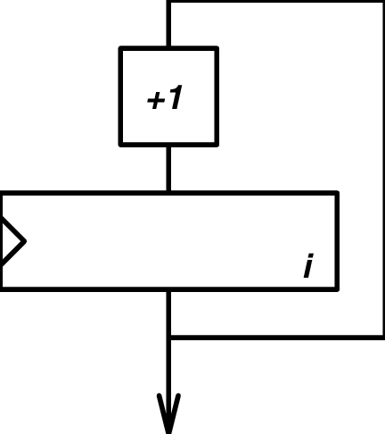
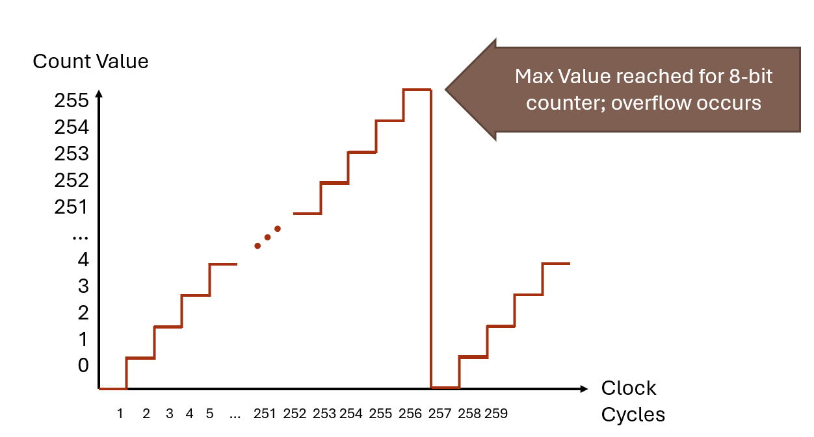
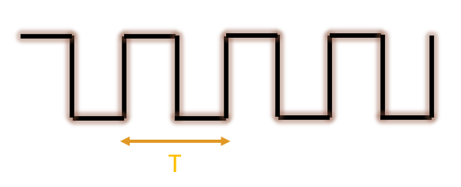

## Learning Objectives

In this chapter we will learn:

-   What is a timer?

-   How do we create precise time delays?

-   How to use Pulse Width Modulation?

## What is a Timer?

Timers are devices used to measure… time! This is critical in many embedded systems applications as we are often interacting with other connected devices where precise timing is important for controlling and interacting with those devices. For example, consider a microwave oven driven by an embedded system. The purpose of the microwave is to activate the magnetron for a specified length of time to heat up your food. This example is fairly obvious, but we’ll see that there are many, more subtle yet extremely critical applications of timers.

## Counters

A timer is really an extended concept of another device called a “counter”! Counters are devices which simply store a value and increment or decrements that value on each clock edge.

{#fig-ch05-5-1}

Figure 5.1 describes a simple 8-bit up-counter circuit. This particular counter architecture includes an incrementor and a register, although there are many varieties of up counter implementations (For example, up-counters can commonly be made from chaining T-Flip Flops together). This up-counter increments the stored value in its register by 1 on each rising clock edge.

We can visualize the value of this simple up-counter by graphing the stored count value over time. Figure 5.2 illustrates this graph by plotting the count value on the Y-axis and clock cycles along the X-axis.

{#fig-ch05-5-2}

We see in Figure 5.2, that the count value increments on each complete period of the clock. For the first 255 clock cycles, the count value equals the number of clock cycles that have passed. However, once we reach 256 clock cycles, the timer’s register overflows and it resets back to 0. This is because 255 is the maximum value that can be stored in an 8-bit value. After the overflow occurs, the counter starts counting up from 0 all over again.

Counters come with many different features and variations. The two largest variations are “up” and “down” counters. As the name suggests, a down-counter decrements the stored value rather than incrementing as the up-counter does. Counters also often include the ability to load a specific value into the counting register, which is especially important for the down counter, as it is often desirable to have a circuit count down from a specified value. Figure 5.3 illustrates what the architecture for a down counter with these features may look like.

**Figure 5.3:** An 8-bit down counter architecture

## From Counters to Timers

So what makes a timer different from a counter? A timer is simply a counter where the stored count value represents a number of elapsed increments of time. A counter’s value naturally represents an amount of time because the count value increments on each clock edge. If we know the length of the clock signal period, then the value of the counter is a number of periods, which have some known length of time.

{#fig-ch05-5-4}

For instance, if a counter started counting up from 0, and then read the counter after some time, and the count value was 147, we could determine how much time has elapsed since the counter started from 0. If the value is 147, then 147 clock cycles have passed since it started. If the period of clock is 12 milliseconds, then by multiplying 12 times 147, we can find that 1764 milliseconds have passed.

We can formally define this relationship with the equation below:

$$\frac{Desired\ Delay\ Time\ }{Clock\ Period} = Number\ of\ Counts$$

## Categories of Timers

All timers perform the same task: using a counter to count clock cycles. However, timers can be designed with specific applications in mind. The timer described in the previous chapter is generally referred to as a “general purpose timer”. These timers are used for a variety of purposes, such as creating a pulse with a specific period to trigger an ultrasonic sensor or measuring time between two digital signals. However, these timers may prove to be too inaccurate when it comes to measure actual time, like a wrist watch.

General Purpose Timers

Watchdog Timers

Real Time Clock

The TI MSP430G2553 Timer Peripherals

## Recap

\<RECAP HERE\>

## References

1. P.-L. Ageneau, "Chaplier Fou," Aug. 25, 2023. [Online]. Available: <https://chapelierfou.org/blog/a-usb-furby.html>
