## Learning Objectives

In this chapter we will learn:

-   Why embedded systems use communication protocols rather than directly connecting every data bit

-   How a two-controller vacuum robot motivates timing, clock signals, serial links, and bus ownership

-   The differences between parallel and serial communication

-   The meaning of synchronous, asynchronous, simplex, half-duplex, and full-duplex communication

-   How UART frames data and how baud rate determines timing

-   How to configure and use the MSP430G2553 USCI_A0 peripheral for UART communication

-   How SPI exchanges data through clocked shift registers

-   How I²C uses addressing, acknowledgments, open-drain signaling, and repeated START conditions

-   How CAN provides robust multi-controller communication in noisy systems

-   How to choose an appropriate serial protocol for an embedded application

## Embedded Systems Need to Communicate

An embedded application often contains several microcontrollers instead of one large processor that performs every task. Different controllers can be located near the sensors and actuators they manage, can execute independently, and can be selected to match the timing, cost, and power requirements of a particular subsystem. The resulting devices must still cooperate. Dividing the work among processors therefore creates a new engineering problem: how do those processors exchange information?

### One Vehicle, Many Microcontrollers

A modern vehicle provides a familiar example. Separate electronic control units may manage fuel injection and ignition timing, the transmission, anti-lock braking, airbag deployment, electric power steering, climate control, infotainment, navigation, and driver-assistance features. These are not isolated products that happen to share the same chassis. For example, a stability-control system may need wheel-speed information from the braking system, steering-angle information from another controller, and a torque-reduction response from the engine controller.

The practical difficulty is not deciding whether one controller can produce a high or low voltage on a GPIO pin. We have already seen that a microcontroller can do this. The difficulty is deciding how those voltages should represent useful information, how the receiving controller knows when to read them, and what happens when several devices need to communicate. To develop the solution gradually, we will begin with a smaller and more concrete embedded system.

### A Vacuum Robot as a Running Example

Consider an autonomous vacuum robot. The robot has a front bump sensor that indicates when the chassis contacts an obstacle. It has drive motors that move the wheels and additional motors that operate the vacuum mechanism. It also has wheel encoders, which produce pulses as the wheels rotate so the electronics can estimate wheel speed and distance traveled.

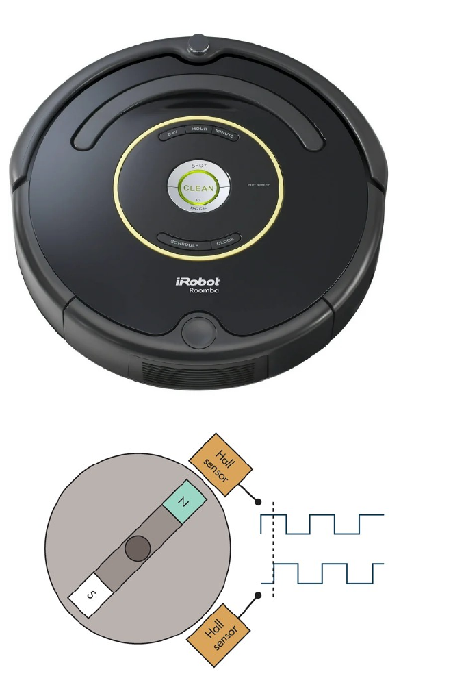{#fig-ch07-4-1}

Suppose the design uses two microcontrollers. Microcontroller 1 reads the bump sensor and executes the high-level behavior of the robot. Its program may implement a state machine that drives forward, stops when the bumper is pressed, backs away, turns, and resumes cleaning. Microcontroller 2 operates the motor-driver circuit and reads the wheel encoders. Its program can concentrate on generating motor-control signals and monitoring wheel motion.

Now suppose Microcontroller 1 decides that the left wheel should run at a particular speed. The desired speed exists as a number inside Microcontroller 1, but the motor hardware is controlled by Microcontroller 2. Likewise, Microcontroller 2 may measure the actual wheel speed and need to send that measurement back. The motor controller and supervisory controller therefore need a way to transmit numbers between them.

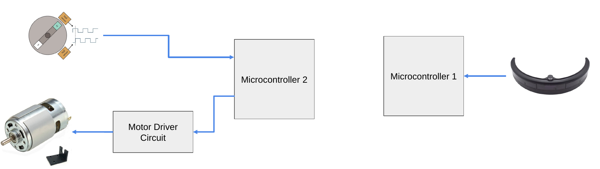{#fig-ch07-4-2}

This is the central question that motivates the remainder of the chapter: if one microcontroller has an 8-bit value that the other microcontroller needs, how can we move that value between the devices? Rather than beginning with the name of an established protocol, we will build an answer using GPIO concepts that are already familiar.

## Building a Digital Communication Link

### First Attempt: One GPIO Wire for Every Bit

An 8-bit value contains eight individual bits. The most direct solution is therefore to connect eight GPIO output pins on the transmitting microcontroller to eight GPIO input pins on the receiving microcontroller. The devices must also share a ground reference, although the ground connection is omitted from the simplified diagrams so that the data signals remain easy to see.

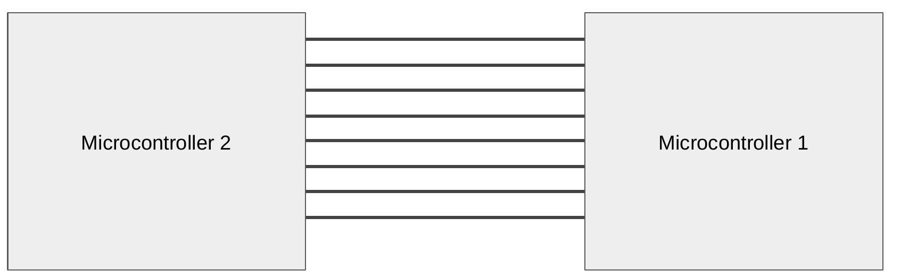{#fig-ch07-4-3}

Each signal carries one bit position. The first wire carries bit 0, the next carries bit 1, and the remaining wires carry bits 2 through 7. The transmitter sets each output high or low according to the value of that bit, and the receiver reads all eight GPIO inputs to reconstruct the complete byte. Because all eight bits are present simultaneously, this arrangement is called parallel communication.

### Sending the Number 21

Consider the decimal number 21. Its eight-bit binary representation is 00010101. Bit 0 is 1, bit 1 is 0, bit 2 is 1, bit 3 is 0, bit 4 is 1, and bits 5 through 7 are 0. The transmitting microcontroller drives the bit-0, bit-2, and bit-4 wires high while holding the other five wires low. When the receiving microcontroller reads the eight inputs, it sees the pattern 00010101 and reconstructs decimal 21.

```c
21 decimal = 0b00010101
bit 7 bit 6 bit 5 bit 4 bit 3 bit 2 bit 1 bit 0
0 0 0 1 0 1 0 1
```

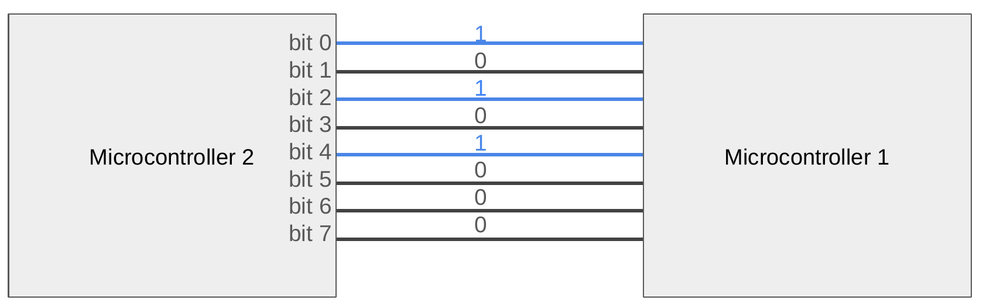{#fig-ch07-4-4}

If the number represents a wheel-speed command, the motor controller can use it immediately. At first, this seems to solve our problem: eight output pins connect to eight input pins, and the transmitted byte appears on the receiver. However, the diagram captures only a single instant. A real robot sends a sequence of commands over time, and that introduces a timing problem.

### When Does One Value End and the Next Begin?

Suppose the transmitting controller sends the sequence 21, 21, 10. The first two values are identical, so none of the eight data wires changes when the transmitter advances from the first 21 to the second 21. The receiver can observe that the wires currently represent 21, but the wires alone do not reveal whether that 21 is the first message, the second message, or a value that has simply remained unchanged.

{#fig-ch07-4-5}

The same observation could correspond to several different message sequences. A receiver might interpret one long interval as 21, 21, 21, 21, 10, 10, while the transmitter intended only 21, 21, 10. This is not a problem with binary representation: both controllers can correctly identify the voltage pattern. It is a problem of synchronization. We must define when each new value becomes available and when the receiver should sample it.

### Attempt 1: Agree on a Sampling Interval

One possible solution is for both microcontrollers to operate on an agreed schedule. For example, the transmitter could place a new byte on the eight GPIO outputs every 10 milliseconds, and the receiver could read the eight GPIO inputs every 10 milliseconds. If both controllers begin at the same time and maintain compatible timing, the receiver observes the first 21, then the second 21, and then 10.

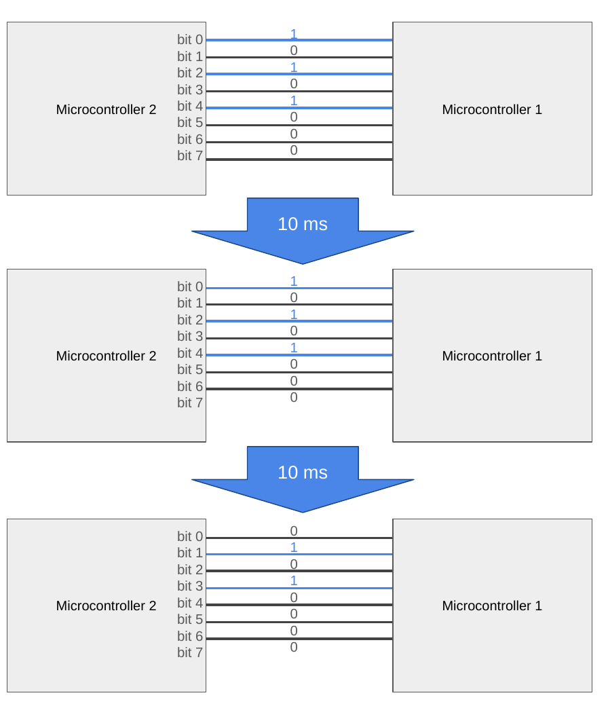{#fig-ch07-4-6}

This arrangement does not require a dedicated timing wire, but the agreement is fragile. The two microcontrollers use separate clock sources, and neither clock is perfectly accurate. If one device runs slightly faster, its sampling points gradually move relative to the other device’s updates. Eventually the receiver may sample the same byte twice, skip a byte, or sample while the transmitter is changing the outputs.

An interrupt, another software task, or an unexpectedly long computation can also cause one device to miss its scheduled update. The fundamental limitation is that the transmitter and receiver infer one another’s timing rather than directly observing a shared timing signal. Communication based on an agreed timing interval without a transmitted clock is asynchronous.

### Attempt 2: Add a Clock Signal

A more direct solution is to add one additional wire that carries a clock signal. The transmitting controller first places a valid byte on the eight data lines and then changes the clock from low to high. The receiving controller watches the clock and reads all eight data lines whenever it observes that rising edge. A new rising edge means a new byte is available even if the new byte has the same value as the previous one.

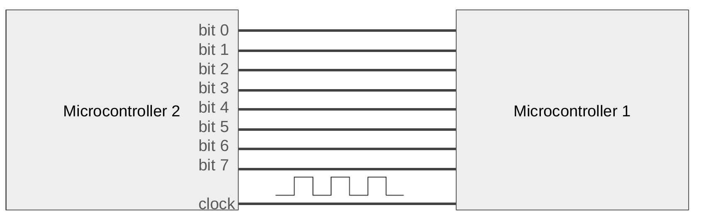{#fig-ch07-4-7}

The sequence 21, 21, 10 is now unambiguous. The receiver samples 21 at the first clock edge, 21 again at the second edge, and 10 at the third edge. The transmitter can speed up, slow down, or pause between transfers because the receiving controller responds to the clock edges rather than assuming that the next byte will appear after a fixed delay.

### Synchronous and Asynchronous Communication

These two approaches introduce an important distinction. Synchronous communication includes a timing signal, usually called a clock, that tells the receiver when data should be sampled. Asynchronous communication does not transmit a separate clock. Instead, both devices must agree on timing parameters and use their local clocks to estimate when the data should be read.

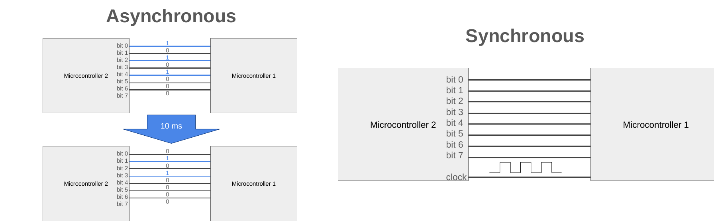{#fig-ch07-4-8}

Synchronous interfaces can often operate more reliably at high speeds because the transmitter explicitly identifies the sampling instants. This does not mean asynchronous interfaces are unreliable. Practical asynchronous protocols add synchronization markers and limit how long the receiver must remain aligned without resynchronizing. UART, which we will study shortly, is an example of a carefully structured asynchronous interface.

## From Parallel Communication to Serial Communication

### The Cost of a Wide Parallel Bus

Our clocked parallel interface transfers an entire byte on each clock edge, but the connection requires eight data pins plus one clock pin on each microcontroller. If the robot also needs bump sensors, motor-control outputs, encoder inputs, indicators, and other peripherals, dedicating nine pins to a single communication channel is expensive. Wider data transfers consume even more pins: a 16-bit interface would require sixteen data wires plus timing and control signals.

The wiring also increases connector size, printed-circuit-board routing complexity, and cable cost. At higher speeds, the individual wires do not necessarily deliver their signals to the receiver at exactly the same instant. Differences in trace length and electrical loading produce timing skew, which can force the receiver to wait for the slowest signal before safely sampling the group.

### Reuse One Wire for Every Bit

Instead of providing a separate wire for each bit, suppose we place one bit at a time on a single data wire. The transmitter drives the first bit onto the wire and produces a clock edge. The receiver samples the wire and stores that bit. The transmitter then places the next bit on the same wire, generates another clock edge, and repeats the process until all eight bits have been transferred.

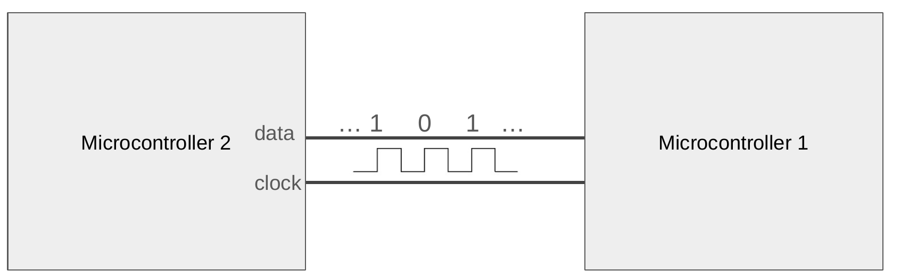{#fig-ch07-4-9}

The receiving controller reconstructs the original byte by collecting the bits in their agreed order. For decimal 21, an interface that sends the most-significant bit first transmits 0, 0, 0, 1, 0, 1, 0, 1. An interface that sends the least-significant bit first transmits 1, 0, 1, 0, 1, 0, 0, 0. Either order is valid as long as both devices follow the same convention.

This is serial communication: the individual bits of a value move sequentially over a shared data path rather than simultaneously across separate wires. The transfer now requires eight clock edges instead of one, but the number of data wires falls from eight to one. The resulting savings in pins, wiring, board area, and connector size explain why serial communication dominates modern embedded systems.

### Familiar Examples of Parallel and Serial Interfaces

Older desktop computers often included a parallel printer port, which transferred several data bits simultaneously, and a serial port, which transferred bits sequentially using asynchronous signaling such as UART with RS-232 electrical levels. Universal Serial Bus, or USB, is another familiar serial interface, although its signaling and packet structure are substantially more complex than the UART, SPI, and I²C examples in this chapter.

The important distinction is not whether a connector is physically large or small. Parallel communication dedicates multiple data wires to the bits of a value. Serial communication reuses a smaller number of data wires over successive bit periods. Whether the timing is synchronous or asynchronous is a separate design choice.

## Who Is Allowed to Transmit?

### Simplex Communication

So far, our serial example sends data from one microcontroller to the other. One device acts as the transmitter, labeled TX, and the other acts as the receiver, labeled RX. If information is only allowed to move in this one direction, the connection is simplex. A sensor that only reports measurements to a controller can operate this way.

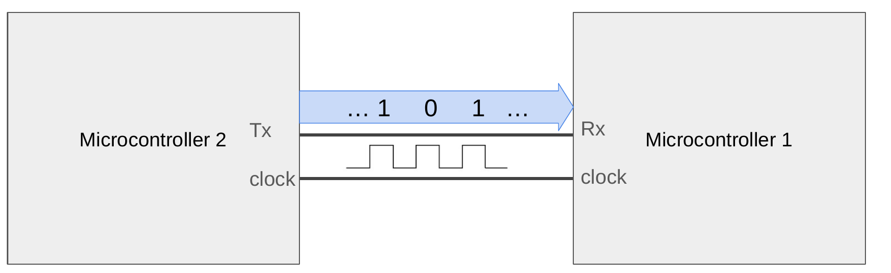{#fig-ch07-4-10}

Simplex communication is not sufficient for the vacuum robot if the supervisory controller needs to send motor-speed commands while the motor controller also needs to return encoder measurements. We must extend the connection so both devices can transmit.

### Sharing a Bidirectional Data Wire

One option is to let both devices use the same data wire. A microcontroller configures its GPIO pin as an output when it is transmitting and as an input when it is receiving. After one message is complete, the devices can reverse their roles. The wire is therefore capable of carrying information in either direction, but only when both controllers agree about which one currently owns it.

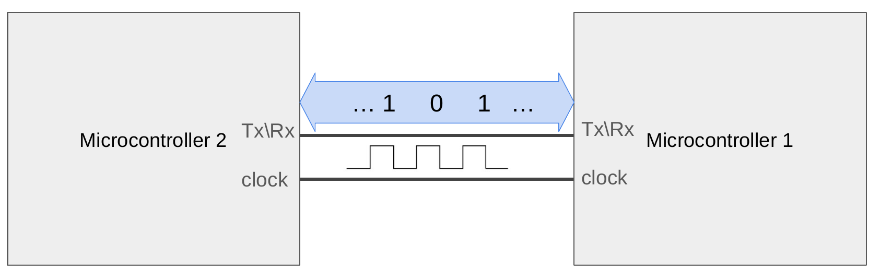{#fig-ch07-4-11}

### What Happens If Both Devices Transmit?

Sharing one actively driven signal creates an immediate concern: what if both microcontrollers attempt to transmit at the same time? Suppose one controller drives the line high while the other controller drives the same line low. The outputs are now attempting to impose incompatible voltages on the same conductor. The resulting condition is called bus contention.

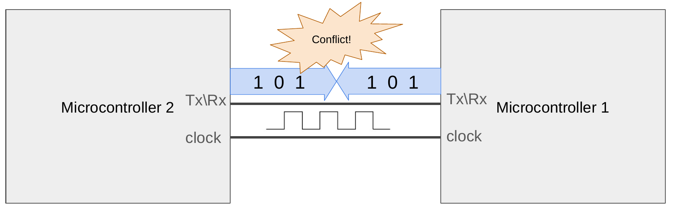{#fig-ch07-4-12}

Bus contention can produce an undefined logic level, corrupted data, excessive current, and potentially damaged output drivers. A shared interface therefore needs a rule that prevents simultaneous push-pull transmission. Software can assign turns, hardware can select one device at a time, or the electrical interface can use a signaling method such as the open-drain outputs used by I²C.

### Half-Duplex Communication

When both devices can communicate but must take turns on the same data path, the interface is half-duplex. Microcontroller 1 may transmit a motor command, release the line, and then allow Microcontroller 2 to transmit its encoder feedback. Both directions are supported, but they cannot carry independent messages simultaneously.

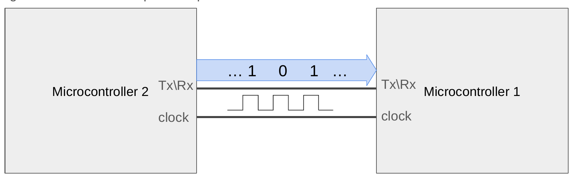{#fig-ch07-4-13}

A half-duplex protocol must define when a device is allowed to begin, how the other device recognizes the end of the current message, and who controls the line during responses. These rules may be implemented through timing, addressing, arbitration, chip-selection signals, or electrical conventions. The reduced pin count is useful, but coordinating bus ownership adds complexity.

### Full-Duplex Communication

The alternative is to add a second data wire. One wire carries information from Microcontroller 1 to Microcontroller 2, and the other carries information from Microcontroller 2 to Microcontroller 1. Each output drives only its dedicated direction, so both devices can send data at the same time without competing for the same conductor. This arrangement is full-duplex communication.

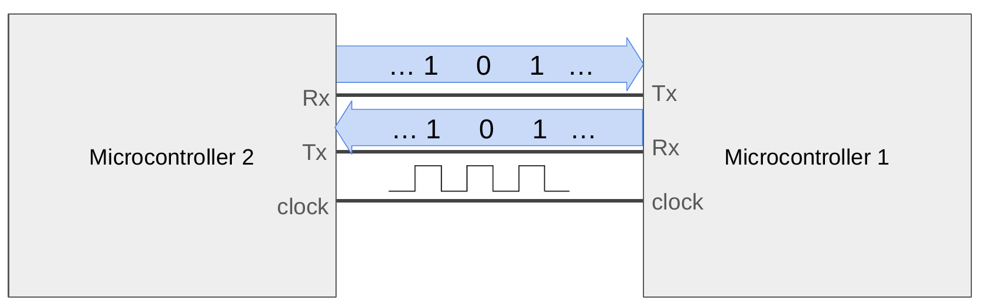{#fig-ch07-4-14}

These classifications reappear throughout the remainder of the chapter. UART normally uses a dedicated transmit wire and a dedicated receive wire, allowing full-duplex operation. SPI also has separate controller-output and controller-input data paths, so it can shift bits in both directions on each clock cycle. I²C shares one bidirectional data line and therefore operates as a half-duplex interface. CAN likewise uses a shared bus, but its electrical signaling and arbitration rules determine which message wins when multiple devices begin transmitting.

## Asynchronous Serial Communication

The clocked serial link in the previous example requires one data wire plus one clock wire for a single direction. We can reduce the required wiring further if the transmitter and receiver agree on how long each bit remains valid and add a recognizable marker that announces the beginning of a message. The receiver can then reconstruct the sampling instants from its own local clock. This idea leads directly to UART.

## Universal Asynchronous Receiver/Transmitter

A Universal Asynchronous Receiver/Transmitter, normally shortened to UART, is a hardware peripheral that converts bytes in the processor into timed serial frames and converts received frames back into bytes. The word universal reflects that the peripheral can be configured for several frame formats and rates. UART describes the digital communication mechanism inside the devices. It does not by itself specify a connector or a long-distance electrical standard.

A UART link normally uses one transmit signal, one receive signal, and a shared ground. Because no clock is transmitted, the devices must agree on the baud rate, number of data bits, parity setting, and number of stop bits. A common configuration is written as 9600 8N1: 9600 baud, eight data bits, no parity, and one stop bit.

### Baud Rate and Bit Time

Baud rate is the number of symbols transmitted each second. A simple UART represents one bit with each symbol, so its baud rate is numerically equal to its bit rate. At 9600 baud, one bit occupies

```c
bit time = 1 / 9600 = 104.17 microseconds
```

A complete frame contains more than the eight payload bits. With 8N1 formatting, one start bit and one stop bit are added, giving ten transmitted bits per byte. The maximum payload rate is therefore 960 bytes per second, not 1200 bytes per second. This distinction matters when estimating whether an interface is fast enough for a stream of measurements.

### Framing a UART Message

The UART signal remains high while the link is idle. To begin a frame, the transmitter drives the signal low for one bit period. This start bit creates an edge that allows the receiver to synchronize its local timing. The data bits follow, usually least-significant bit first. An optional parity bit may be added, followed by one or more high stop bits. The stop bit returns the signal to the idle condition and provides separation before the next frame.

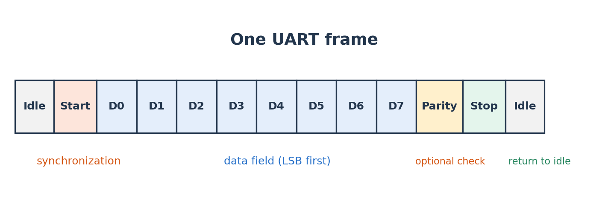{#fig-ch07-4-15}

#### Data Bits

Most current embedded applications use eight data bits because a byte is the natural unit of memory and text encodings such as ASCII fit within a byte. UART hardware can also support shorter data fields for older or specialized systems. The transmitter and receiver must use the same length. If one side expects seven data bits while the other sends eight, every following field will be interpreted at the wrong location.

#### Start and Stop Bits

The start bit is always the opposite of the idle level. The receiver detects the high-to-low transition and waits approximately half a bit period before confirming the start bit near its center. It then samples each data bit one bit period apart. After the final data or parity bit, the receiver expects a high stop bit. If the signal is low where the stop bit should occur, the UART reports a framing error. A framing error commonly indicates mismatched baud rates, incorrect frame settings, electrical noise, or a wire connected to the wrong signal.

#### Parity

Parity provides simple error detection. With even parity, the transmitter selects the parity bit so the total number of 1 bits in the data and parity field is even. Odd parity makes the total odd. If one bit changes during transmission, the receiver computes a different parity and reports an error. Parity cannot correct the damaged data, and it cannot detect every multi-bit error. Many short, reliable UART links omit parity and rely on a higher-level checksum when stronger protection is needed.

### A 9600 8N1 Example

Suppose the vacuum robot reports that a command completed successfully by transmitting the two-character message OK. The ASCII value of uppercase O is decimal 79, or hexadecimal 0x4F; its eight-bit binary representation is 01001111. Uppercase K is decimal 75, or hexadecimal 0x4B; its binary representation is 01001011. UART creates a separate frame for each character rather than transmitting the letters as one unstructured voltage sequence.

```c
'O' = 79 decimal = 0x4F = 0b01001111
'K' = 75 decimal = 0x4B = 0b01001011
```

The figure below shows a frame carrying the character O. The start bit is low, the eight data bits are transmitted least-significant bit first, and the stop bit is high. Every bit occupies approximately 104 microseconds at 9600 baud. The entire ten-bit frame therefore requires approximately 1.04 milliseconds, and the two-character message requires approximately 2.08 milliseconds before any optional spacing between frames.

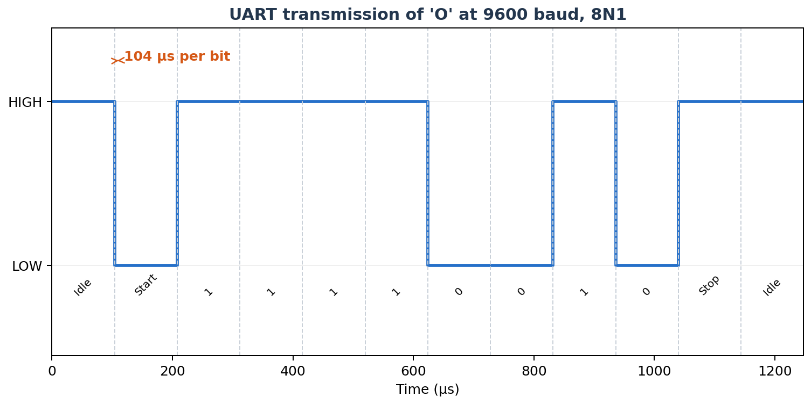{#fig-ch07-4-16}

The receiver does not need a clock edge for every bit. It assumes that the edges between bit cells occur at multiples of the configured bit time after the start edge. Sampling near the center of each cell gives the largest tolerance to jitter and clock mismatch. The frame is deliberately short so timing error does not accumulate indefinitely.

### UART Wiring and Voltage Levels

The transmit output of one device must connect to the receive input of the other. Connecting TX to TX causes both outputs to drive the same line and leaves neither receiver connected to useful data. The devices also need a common ground so their voltage thresholds have the same reference. The following diagram shows the normal cross-connection.

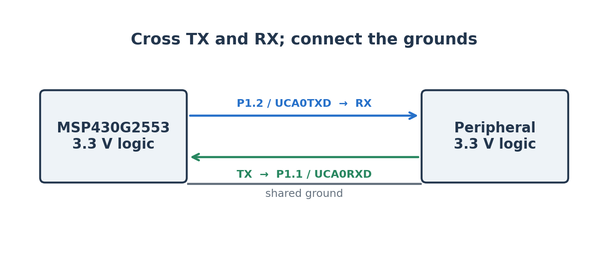{#fig-ch07-4-17}

The MSP430G2553 uses logic-level signals near its supply voltage. These signals are often informally called TTL serial, although a 3.3-V CMOS output is not literally the older 5-V TTL standard. Logic-level UART should only connect directly to a device with compatible voltage thresholds. A 5-V output can damage a 3.3-V-only input unless a level shifter or voltage divider is used.

RS-232 is a different electrical standard that also carries asynchronous serial frames. It uses positive and negative voltages and reverses the logical polarity relative to a typical microcontroller UART. An RS-232 cable must not be connected directly to an MSP430 pin. A transceiver such as the MAX3232 translates between the voltage domains. Likewise, the USB connector on a computer does not carry UART voltage levels. A USB-to-UART bridge is required to create a virtual serial port.

## The MSP430G2553 Serial Communication Hardware

The MSP430G2553 contains a Universal Serial Communication Interface, abbreviated USCI. This name is easy to confuse with the simpler USI peripheral found on some other MSP430 devices. The distinction matters: the MSP430G2553 uses USCI, and its USCI_A0 module includes UART hardware. A plain USI module supports synchronous interfaces but does not provide UART.

The device contains two related modules. USCI_A0 supports UART and SPI. USCI_B0 supports SPI and I²C. Each module can operate in only one mode at a time, so using USCI_A0 for UART means that same module cannot simultaneously provide an additional SPI bus. The following diagram summarizes the relationship between the CPU, the USCI modules, and the pins.

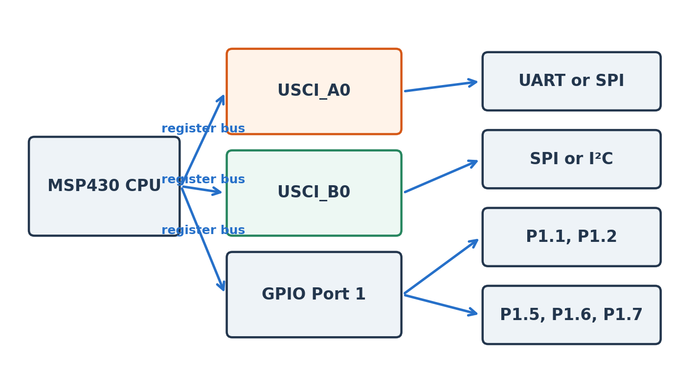{#fig-ch07-4-18}

### Finding the UART Pins

Peripheral hardware is connected internally to selected package pins. The MSP430G2553 pinout identifies P1.1 as UCA0RXD and P1.2 as UCA0TXD. The same pins can also serve as GPIO or SPI signals, so software must select the peripheral function before UART data can reach the pins. The P1SEL and P1SEL2 registers control this routing.

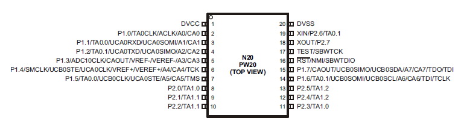{#fig-ch07-4-19}

```c
P1SEL |= BIT1 | BIT2;
P1SEL2 |= BIT1 | BIT2;
```

Setting both selection bits for P1.1 and P1.2 connects those pins to USCI_A0. From that point, the UART peripheral rather than the ordinary GPIO data registers controls the pins. When debugging a serial connection, checking the pin-selection registers is just as important as checking the UART registers.

### USCI_A0 UART Registers

The UART configuration is distributed across several memory-mapped registers. UCA0CTL0 selects the frame format. UCA0CTL1 selects the clock source and contains the UCSWRST software-reset bit. UCA0BR0, UCA0BR1, and UCA0MCTL form the baud-rate generator. UCA0TXBUF and UCA0RXBUF provide the software-visible transmit and receive buffers. The IE2 and IFG2 special-function registers contain interrupt-enable and status flags associated with USCI_A0.

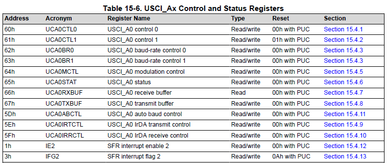{#fig-ch07-4-20}

#### Frame Format: UCA0CTL0

The UCA0CTL0 register controls parity, bit order, data length, stop bits, and operating mode. Standard 8N1 UART is represented by the reset values for these format fields: parity disabled, least-significant bit first, eight data bits, one stop bit, asynchronous mode. Explicitly writing zero to the register makes this intent clear.

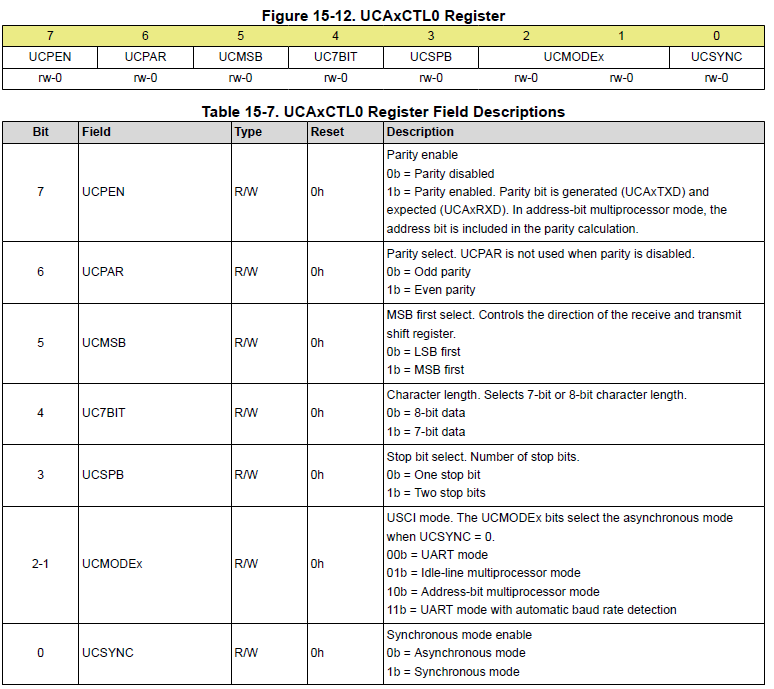{#fig-ch07-4-21}

#### Clock Source and Reset: UCA0CTL1

USCI configuration should be changed while the module is held in software reset. UCSWRST is set before modifying the mode and baud-rate registers. UCSSEL_2 selects the subsystem master clock, SMCLK, as the bit-clock source. Clearing UCSWRST after configuration allows the peripheral state machine to operate.

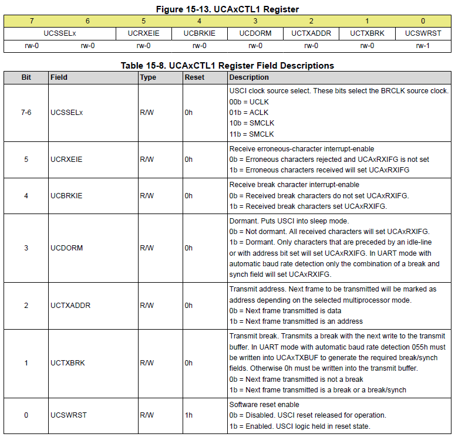{#fig-ch07-4-22}

### Configuring the Baud-Rate Generator

The baud-rate generator divides a source clock into the timing used by the UART. Let fBRCLK be the selected clock frequency and fbaud be the desired baud rate. The ideal divider is

```c
N = fBRCLK / fbaud
```

For a calibrated 1-MHz SMCLK and 9600 baud, N is 104.167. The integer portion, 104, is written into the combined UCA0BR1:UCA0BR0 divider. The remaining fraction cannot be represented by the integer divider, so UCA0MCTL periodically adjusts the timing. Texas Instruments tabulates modulation settings for common frequencies. At 1 MHz and 9600 baud, the recommended settings are UCA0BR0 = 104, UCA0BR1 = 0, and UCA0MCTL = UCBRS0.

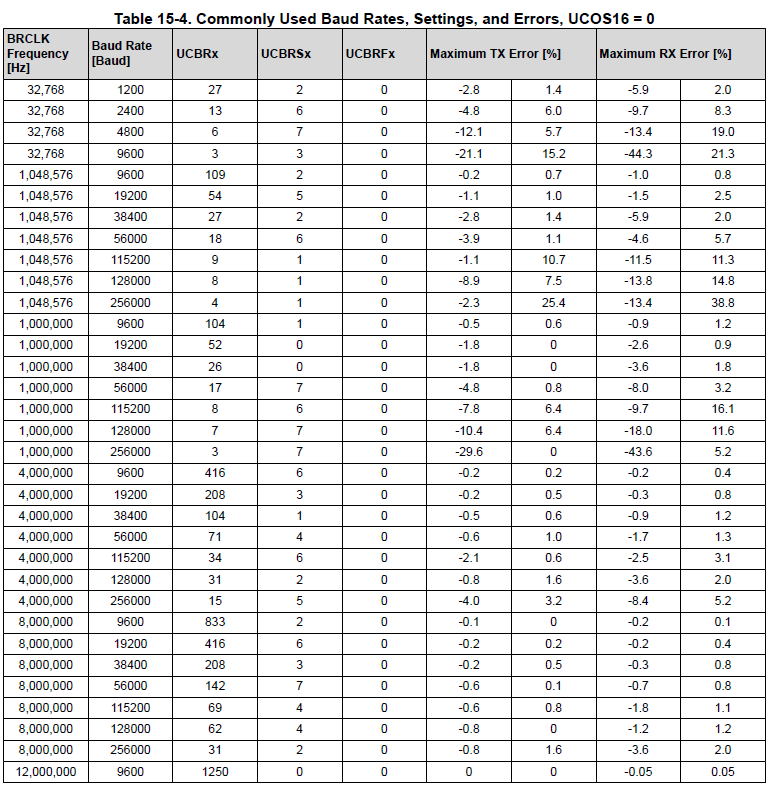{#fig-ch07-4-23}

The calibrated-clock constants stored in the device information memory are used to configure the digitally controlled oscillator. Production code should verify that these calibration constants are valid before using them, because an erased information segment contains 0xFF rather than usable values.

### Example: Transmitting a Character

The following program configures USCI_A0 for 9600-baud 8N1 communication and transmits the character 'A' approximately once per second. The transmit function waits for UCA0TXIFG before writing UCA0TXBUF. The flag indicates that the transmit buffer can accept another byte; it does not necessarily mean the final stop bit has already left the pin.

```c
#include <msp430.h>
static void uart_init(void)
{
    BCSCTL1 = CALBC1_1MHZ;
    DCOCTL = CALDCO_1MHZ;
    P1SEL |= BIT1 | BIT2;
    P1SEL2 |= BIT1 | BIT2;
    UCA0CTL1 = UCSWRST | UCSSEL_2;
    UCA0CTL0 = 0; // 8 data, no parity, 1 stop
    UCA0BR0 = 104; // 1 MHz / 9600 baud
    UCA0BR1 = 0;
    UCA0MCTL = UCBRS0;
    UCA0CTL1 &= ~UCSWRST;
}
static void uart_send(char value)
{
    while ((IFG2 & UCA0TXIFG) == 0) {
        // Wait until UCA0TXBUF is available.
    }
    UCA0TXBUF = value;
}
int main(void)
{
    WDTCTL = WDTPW | WDTHOLD;
    uart_init();
    while (1) {
        uart_send('A');
        __delay_cycles(1000000);
    }
}
```

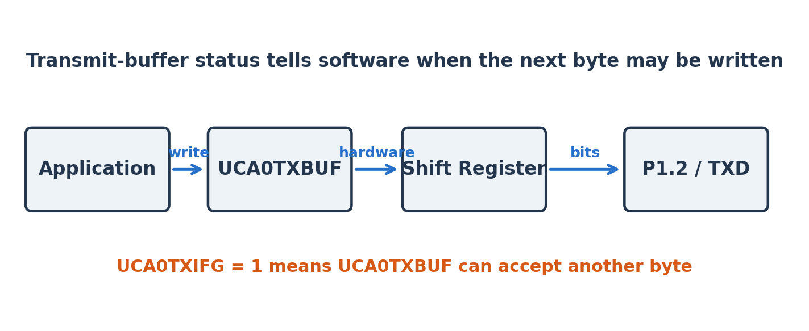{#fig-ch07-4-24}

The processor does not manually toggle P1.2 for every bit. Software writes one byte to UCA0TXBUF, and the USCI hardware moves that byte into an internal shift register when the transmitter is ready. The shift register generates the start bit, data bits, and stop bit with the configured timing. This division of responsibility is one of the primary benefits of a hardware peripheral.

### Receiving Data by Polling

The receive side works in the opposite direction. USCI_A0 monitors P1.1, recognizes a valid start bit, samples the data, checks the frame, and places the completed byte in UCA0RXBUF. UCA0RXIFG is set when the byte is ready. Reading UCA0RXBUF clears the receive flag. A simple blocking receive function is shown below.

```c
static char uart_receive(void)
{
    while ((IFG2 & UCA0RXIFG) == 0) {
        // Wait for a complete frame.
    }
    return UCA0RXBUF;
}
```

Polling is appropriate when the program has nothing useful to do until a byte arrives. It becomes wasteful when the processor should handle other work or enter a low-power mode. If a byte arrives while UCA0RXBUF still holds unread data, the previous value can be overwritten and an overrun error can occur. The program must service the receiver quickly enough or use an interrupt and a software buffer.

### Interrupt-Driven UART Echo

An echo program sends every received character back to the transmitter. It is useful because one short test exercises the pin routing, baud-rate settings, receive hardware, interrupt system, and transmit hardware. The receive interrupt allows the main program to sleep until a character arrives.

```c
#include <msp430.h>
int main(void)
{
    WDTCTL = WDTPW | WDTHOLD;
    BCSCTL1 = CALBC1_1MHZ;
    DCOCTL = CALDCO_1MHZ;
    P1SEL |= BIT1 | BIT2;
    P1SEL2 |= BIT1 | BIT2;
    UCA0CTL1 = UCSWRST | UCSSEL_2;
    UCA0CTL0 = 0;
    UCA0BR0 = 104;
    UCA0BR1 = 0;
    UCA0MCTL = UCBRS0;
    UCA0CTL1 &= ~UCSWRST;
    IE2 |= UCA0RXIE;
    __bis_SR_register(LPM0_bits | GIE);
    while (1) {
        // Execution resumes here only if the ISR wakes the CPU.
    }
}
#pragma vector=USCIAB0RX_VECTOR
__interrupt void usci_rx_isr(void)
{
    char received = UCA0RXBUF;
    while ((IFG2 & UCA0TXIFG) == 0) {
        // Wait for the transmit buffer.
    }
    UCA0TXBUF = received;
}
```

The MSP430G2553 combines the USCI_A0 and USCI_B0 receive sources into the USCIAB0RX_VECTOR. A larger program should inspect the flags to determine which module caused the interrupt. This example only enables the UCA0 receive interrupt, so reading UCA0RXBUF is sufficient. An application that receives a continuous stream would normally place bytes into a circular buffer and let the main program process them outside the interrupt service routine.

### Using the LaunchPad USB Connection

The MSP430 LaunchPad includes a debugger or emulator section that communicates with the host computer through USB. In addition to programming and debugging the target, the emulator can bridge the target UART to a virtual serial port. P1.1 and P1.2 must be routed through the board jumpers in the hardware-UART orientation. The host then opens the serial port using a terminal application and selects the same baud rate, data length, parity, and stop-bit settings as the MSP430.

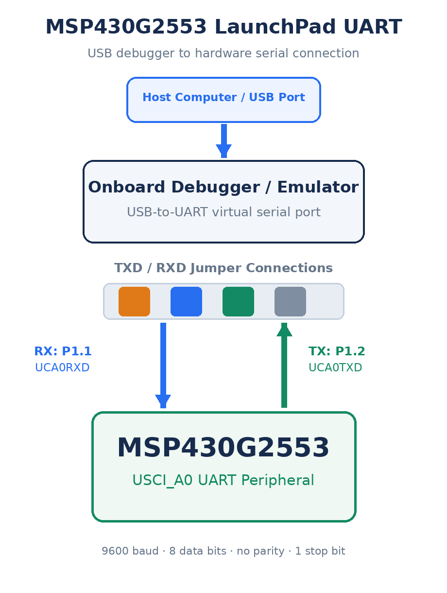{#fig-ch07-4-25}

A useful troubleshooting order is to first confirm that the correct serial port appears on the computer, then confirm the terminal settings, then verify the LaunchPad jumper orientation, and finally inspect the MSP430 clock, pin-selection, and USCI registers. Randomly changing the baud rate rarely fixes a connection whose actual problem is swapped wires or the wrong virtual port.

### Common UART Failure Modes

-   No characters appear: verify common ground, TX-to-RX wiring, pin selection, peripheral reset state, and terminal port.

-   Unreadable characters appear consistently: verify baud rate, SMCLK frequency, data length, parity, and stop-bit settings.

-   Only the first character is correct: check whether software waits for UCA0TXIFG before each write.

-   Characters are occasionally missing: service UCA0RXBUF sooner or add an interrupt-driven software buffer.

-   The signal is electrically wrong: confirm compatible logic levels and do not connect RS-232 voltages directly.

## Synchronous Serial Communication

UART removes the clock wire by requiring both devices to agree on a baud rate and frame format. That is convenient for a terminal or another point-to-point connection, but the two devices still depend on separate local clocks. A synchronous serial interface instead returns to the clocked arrangement introduced with the vacuum robot: one device produces a timing signal that tells the receiving device exactly when to sample each bit.

Because the clock is transmitted along with the data, a synchronous controller can deliberately pause between bits, change its clock frequency between transactions, and coordinate an entire exchange without asking the target to infer the bit timing. SPI and I²C both use this principle, but they make different choices about wiring, device selection, direction, and bus ownership.

## Serial Peripheral Interface

Serial Peripheral Interface, or SPI, is a synchronous protocol commonly used between a controller and nearby peripherals such as displays, analog-to-digital converters, flash memory, radio modules, and microSD cards. Unlike UART, SPI transmits a clock signal. The controller decides when each bit occurs and can change the clock rate between transactions as long as the peripheral limits are respected.

### SPI Signals

A conventional four-signal SPI connection contains a serial clock, a controller-output data signal, a controller-input data signal, and a chip-select signal. Signal names vary among manufacturers. SIMO and SOMI mean slave-in/master-out and slave-out/master-in in older terminology; MOSI and MISO are also common. Newer documentation may use controller and peripheral language. Regardless of the label, one data wire carries bits from the controller and the other carries bits back.

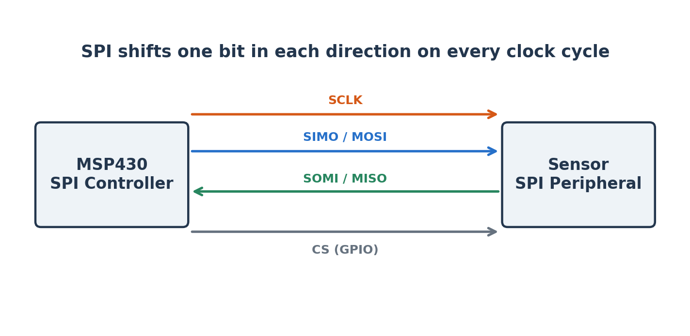{#fig-ch07-4-26}

SPI is inherently a shift-register exchange. Every clock cycle shifts one bit out of each device and one bit into each device. To read a register, the controller must still transmit something—often an address followed by dummy bytes—to generate the clock cycles that return the requested data. This behavior can be surprising after using UART, where receiving does not require simultaneous transmission.

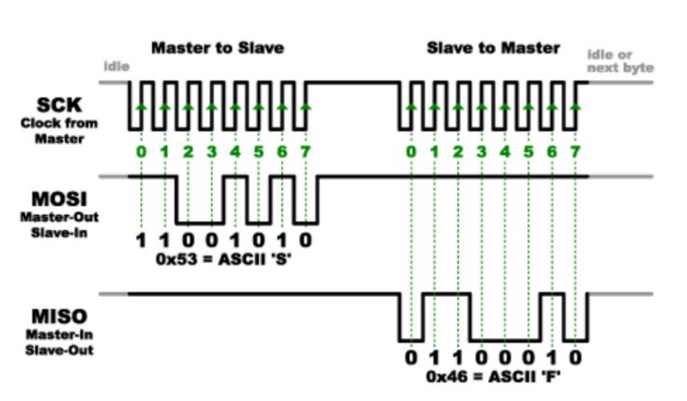{#fig-ch07-4-27}

Notice that the target cannot decide to send an arbitrary number of bits whenever it wants. The controller owns the clock, so it must know when a response is expected and generate enough clock pulses to receive that response. A sensor datasheet normally specifies whether the first transferred byte is an address, a command, a dummy value, or returned data.

### Clock Polarity and Phase

SPI does not define one universal sampling edge. Clock polarity determines whether the clock idles low or high. Clock phase determines whether data is captured on the first or second active edge. The four combinations are often called SPI modes 0 through 3. Both devices must use compatible polarity and phase settings. If they disagree, the receiver may sample while the transmitter is changing the bit, producing shifted or unstable data.

A peripheral datasheet normally shows a timing diagram that identifies the idle level, capture edge, maximum clock frequency, setup time, and hold time. Those requirements should determine the USCI configuration. Selecting a mode because it worked for a different sensor is not a reliable method.

### Selecting One of Several Peripherals

The clock and data wires may be shared among several SPI peripherals. The controller activates one device by driving its chip-select signal to the active level, commonly low. All other chip-select signals remain inactive so those devices ignore the clock and release their output connections. Each additional peripheral generally needs another GPIO chip-select pin.

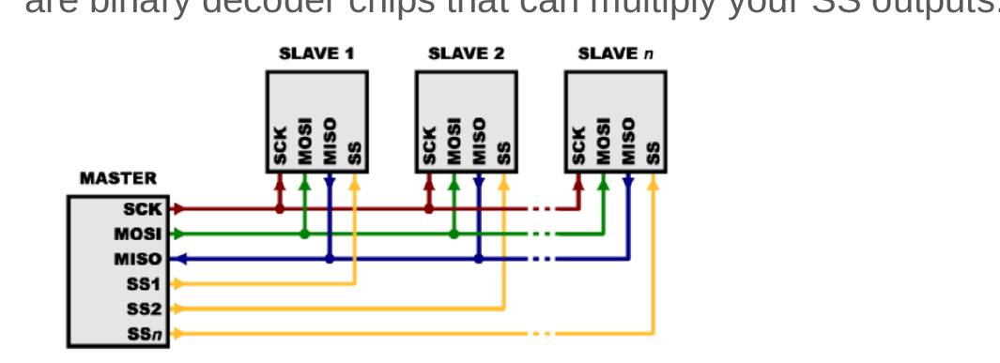{#fig-ch07-4-28}

Some devices support daisy chaining, in which the output of one shift register feeds the input of the next. Daisy chaining reduces the number of select signals but changes the transaction format and increases the number of clock cycles needed to reach a particular device. It should only be used when the peripheral explicitly supports it.

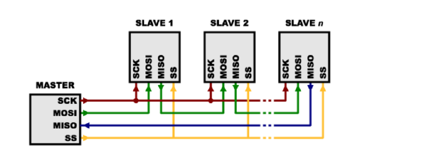{#fig-ch07-4-29}

### SPI on the MSP430G2553

Both USCI_A0 and USCI_B0 can operate in SPI mode. If USCI_A0 is already providing the UART connection to the computer, USCI_B0 is the natural choice for SPI. In USCI_B0 SPI mode, P1.5 provides UCB0CLK, P1.6 provides UCB0SOMI, and P1.7 provides UCB0SIMO. These same P1.6 and P1.7 pins are used for I²C, so USCI_B0 cannot provide SPI and I²C simultaneously.

The following initialization configures USCI_B0 as an 8-bit, most-significant-bit-first SPI controller. UCCKPH and UCCKPL must be selected for the actual peripheral; the example uses UCCKPH with the default low clock polarity. P2.0 is used as a software-controlled active-low chip select.

```c
static void spi_init(void)
{
    P1SEL |= BIT5 | BIT6 | BIT7;
    P1SEL2 |= BIT5 | BIT6 | BIT7;
    P2DIR |= BIT0; // P2.0 is chip select
    P2OUT |= BIT0; // deselect the peripheral
    UCB0CTL1 = UCSWRST | UCSSEL_2;
    UCB0CTL0 = UCCKPH | UCMSB | UCMST | UCSYNC;
    UCB0BR0 = 2; // 500-kHz clock from 1-MHz SMCLK
    UCB0BR1 = 0;
    UCB0CTL1 &= ~UCSWRST;
}
static unsigned char spi_transfer(unsigned char value)
{
    while ((IFG2 & UCB0TXIFG) == 0) {
    }
    UCB0TXBUF = value;
    while ((IFG2 & UCB0RXIFG) == 0) {
    }
    return UCB0RXBUF;
}
```

A complete transaction drives P2.0 low, calls spi_transfer for every command, address, or data byte, waits until the final transfer is complete, and then drives P2.0 high. The returned value from each call is the byte shifted in during the same eight clock cycles. The meaning of those bytes comes from the peripheral datasheet, not from SPI itself.

### When SPI Is a Good Choice

-   Use SPI when a nearby peripheral needs high throughput or predictable clocked timing.

-   SPI is attractive for displays, fast ADCs, external flash memory, microSD cards, and many wireless modules.

-   The protocol is simple in hardware and supports simultaneous shifting in both directions.

-   The tradeoff is pin count: clock, two data signals, and usually one chip-select signal per peripheral.

-   SPI provides no universal addressing, acknowledgment, or error detection; those features must come from the peripheral-specific command format.

### Real-World Example: Wi-Fi and microSD

A Wi-Fi module may need to move command packets and network data faster than a low-rate UART can comfortably support. SPI provides a controller-driven clock and efficient full-duplex transfers while keeping the interface simple. A microSD card can also operate through SPI mode. The card command protocol defines initialization, block addressing, responses, and data tokens on top of the basic SPI signals.

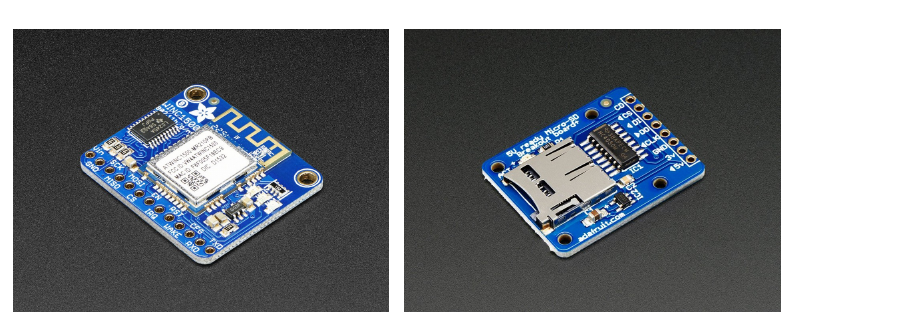{#fig-ch07-4-30}

These applications reveal an important distinction: a serial bus defines how bits move, while a device protocol defines what the bits mean. Correct SPI polarity and timing are necessary, but they are not enough. Software must also implement the command sequence required by the Wi-Fi module or storage card.

## Inter-Integrated Circuit

The Inter-Integrated Circuit bus, written I²C and pronounced “I-squared-C,” is a synchronous, addressed, half-duplex protocol. It uses only two shared signal wires: SCL for the clock and SDA for data. A controller initiates communication, supplies the clock, and selects a target by transmitting its address. Multiple targets can share the same two wires as long as their addresses do not conflict and the total electrical loading remains within specification.

### Open-Drain Signaling and Pull-Up Resistors

I²C devices do not actively drive the bus high. Their outputs behave as open-drain switches that can either pull a signal low or release it. External pull-up resistors return the released wires to a high voltage. This arrangement allows several devices to share the bus safely: if any device pulls a line low, the bus is low. No device attempts to force the line high against another device that is pulling low.

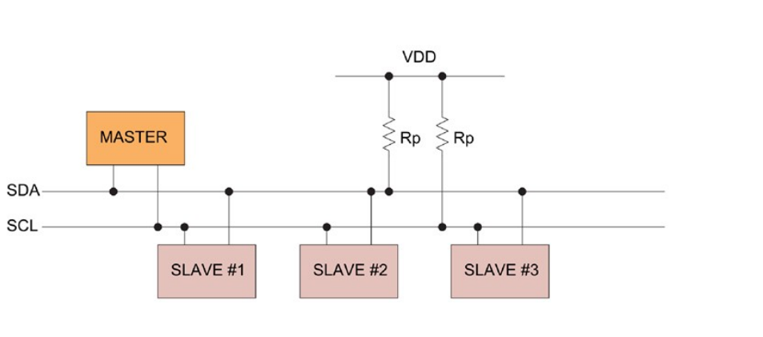{#fig-ch07-4-31}

The pull-up resistance and bus capacitance determine how quickly a released line rises. A large resistance reduces current but slows the edge. A small resistance improves rise time but increases current whenever a device pulls the line low. Long wires, many devices, and large connector structures add capacitance and can prevent the bus from meeting its timing requirement even when the register configuration is correct.

### Following an I²C Transaction

An I²C transaction is more structured than a basic UART character or SPI shift-register exchange. The controller must announce the beginning of the transaction, identify the target device, indicate the direction of transfer, check whether each byte was accepted, and release the bus at the end. The waveform below shows these stages together; the next subsections explain them one at a time.

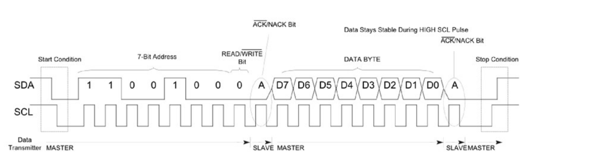{#fig-ch07-4-32}

#### START Condition

An I²C transfer begins with a START condition. While SCL remains high, the controller pulls SDA from high to low. Every device on the shared bus can recognize this unusual transition because ordinary data bits are changed while the clock is low. START therefore tells the targets that an address frame is about to follow.

#### Address Frame and Direction Bit

After START, the controller transmits the seven-bit target address, most-significant bit first. An eighth bit specifies the direction: 0 requests a write from controller to target, while 1 requests a read from target to controller. A device whose configured address matches the transmitted address participates in the remainder of the transfer; devices with other addresses ignore it.

A seven-bit address creates 128 possible bit patterns, but some values are reserved, so not all 128 represent ordinary usable peripheral addresses. The practical number of devices on a bus is also constrained by duplicate fixed addresses and by the total capacitance contributed by devices, traces, and cables.

#### Acknowledgment Bit

Every eight transmitted bits are followed by a ninth clock pulse reserved for acknowledgment. The transmitting device releases SDA, allowing the receiving device to pull it low if the byte was accepted. A low SDA value during this clock pulse is an acknowledgment, or ACK. If SDA remains high, the result is a negative acknowledgment, or NACK.

A NACK may mean that no device recognized the address, that a target is busy or unable to accept another byte, or that a controller has reached the final byte of a read. A program should not assume that an I²C target is present merely because it requested a transaction; acknowledgment is the evidence that another device actually participated.

#### Data Frames

After the address is acknowledged, the controller continues producing SCL pulses for the data bytes. During a write, the controller places each data bit on SDA. During a read, the addressed target places its data on SDA while the controller still generates the clock. Each group of eight data bits is followed by another acknowledgment clock. The physical bus is shared, so only one device supplies a given data bit at a time.

#### STOP and Repeated START

The controller normally ends a transaction by generating STOP: SDA changes from low to high while SCL remains high. This transition releases the bus and tells the targets that the message is complete. The controller may instead issue another START without first generating STOP. This repeated START keeps control of the bus while beginning a new address phase, which is useful when one logical operation contains both a write and a read.

### Writing a Target Register

Many I²C sensors organize their settings and measurements as internal registers. To write a register, the controller addresses the target in the write direction, transmits the internal register address, and then transmits the new value. Each byte is acknowledged. For example, writing 0x00 to register 0x6B of an MPU6050 wakes the device from its default sleep state.

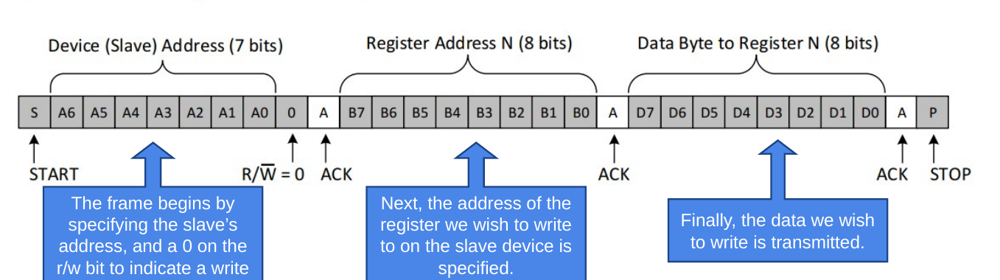{#fig-ch07-4-33}

```c
START | 0x68 + WRITE | ACK | 0x6B | ACK | 0x00 | ACK | STOP
```

### Reading a Target Register

A register read usually begins as a write because the controller must first tell the target which internal register is desired. After transmitting the register address, the controller issues a repeated START and sends the target address again with the read bit set. The target then returns one or more data bytes. The controller acknowledges every byte it wants to continue receiving and NACKs the final byte before generating STOP.

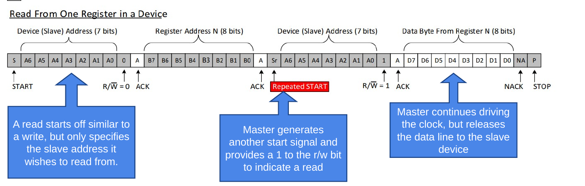{#fig-ch07-4-34}

The repeated START is not an arbitrary complication. If the controller issued STOP between the register-address phase and the read phase, another controller could claim the bus or the target could interpret the operations as unrelated transactions. Keeping the bus active makes the two phases one atomic operation.

### I²C on the MSP430G2553

USCI_B0 provides the I²C hardware. P1.6 is UCB0SCL and P1.7 is UCB0SDA. Both P1SEL and P1SEL2 must select the peripheral functions. In controller mode, UCMST enables controller operation, UCMODE_3 selects I²C, and UCSYNC selects synchronous operation. UCB0BR0 and UCB0BR1 divide SMCLK to create SCL. With a 1-MHz SMCLK and a divider of ten, the nominal SCL frequency is 100 kHz.

```c
static void i2c_init(void)
{
    P1SEL |= BIT6 | BIT7;
    P1SEL2 |= BIT6 | BIT7;
    UCB0CTL1 = UCSWRST | UCSSEL_2;
    UCB0CTL0 = UCMST | UCMODE_3 | UCSYNC;
    UCB0BR0 = 10; // 100-kHz SCL from 1-MHz SMCLK
    UCB0BR1 = 0;
    UCB0CTL1 &= ~UCSWRST;
}
```

Unlike UART, the target address is part of each I²C transaction. The unshifted 7-bit address is written to UCB0I2CSA. The USCI hardware places the address and direction bit on the bus when software requests a START condition.

### Real-World Example: An Impact-Detecting Hard Hat

Consider a smart construction hard hat designed to report a potentially dangerous impact. When an object strikes the helmet, the shell experiences a sudden change in acceleration. A small embedded controller can monitor that acceleration and decide whether the event exceeds a threshold that should trigger an alarm or wireless notification.

The controller could measure an analog acceleration signal directly, but many practical sensing devices include their own measurement electronics and expose the result through a digital interface. The system then needs a serial connection between the main microcontroller and the sensor. I²C is attractive because it uses only two signal wires, allows the controller to configure the sensor through internal registers, and supports additional sensors on the same bus.

#### What the Accelerometer Measures

An accelerometer measures acceleration along one or more physical axes. A three-axis device reports separate X, Y, and Z values, allowing software to estimate both the direction and magnitude of an event. In a simplified physical model, a small internal mass responds to acceleration; the sensor converts the resulting displacement or force into an electrical measurement, which on-chip circuitry digitizes.

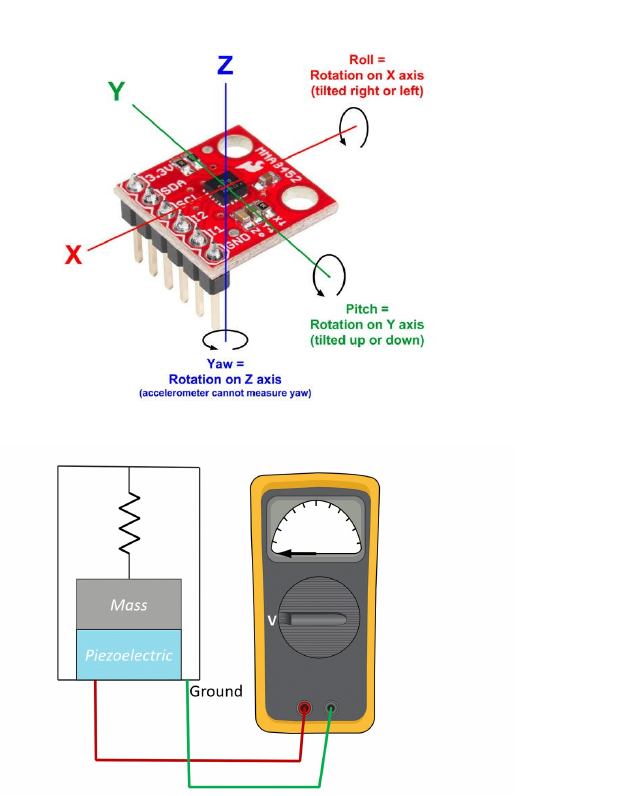{#fig-ch07-4-35}

### Example: Reading the MPU6050 Accelerometer

The MPU6050 is an inertial measurement unit containing a three-axis accelerometer and a three-axis gyroscope. It commonly uses the 7-bit address 0x68 when its AD0 address pin is low. The acceleration measurements begin at internal register 0x3B, with the high and low bytes of the X-axis measurement stored in consecutive registers.

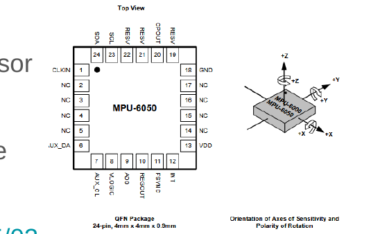{#fig-ch07-4-36}

For the impact-detecting hard hat, the MSP430 first configures the sensor and then reads consecutive acceleration registers. A practical application could periodically measure all three axes, combine them into an overall acceleration magnitude, and compare the result with a threshold. The chapter example concentrates on the serial transaction itself: select the measurement register, issue a repeated START, and retrieve the high and low bytes.

The following example shows the central transaction logic. Error handling is intentionally omitted so the bus sequence remains visible. Production code should detect NACK, arbitration, and bus-stuck conditions and should use timeouts rather than wait forever.

```c
#define MPU6050_ADDRESS 0x68
#define ACCEL_XOUT_H 0x3B
static int i2c_read_accel_x(void)
{
    unsigned char high;
    unsigned char low;
    while (UCB0CTL1 & UCTXSTP) {
    }
    UCB0I2CSA = MPU6050_ADDRESS;
    // Write the internal register address.
    UCB0CTL1 |= UCTR | UCTXSTT;
    while ((IFG2 & UCB0TXIFG) == 0) {
    }
    UCB0TXBUF = ACCEL_XOUT_H;
    while ((IFG2 & UCB0TXIFG) == 0) {
    }
    // Change direction with a repeated START.
    UCB0CTL1 &= ~UCTR;
    UCB0CTL1 |= UCTXSTT;
    while (UCB0CTL1 & UCTXSTT) {
    }
    while ((IFG2 & UCB0RXIFG) == 0) {
    }
    // Tell USCI that the next byte will be the final byte.
    UCB0CTL1 |= UCTXSTP;
    high = UCB0RXBUF;
    while ((IFG2 & UCB0RXIFG) == 0) {
    }
    low = UCB0RXBUF;
    return (int)((high << 8) | low);
}
```

The two received bytes are combined into one signed 16-bit quantity. Because high and low are promoted to int before the shift and OR, the resulting bit pattern can be cast to a signed 16-bit type in a program that includes stdint.h. The raw value must then be scaled according to the accelerometer range configured in the MPU6050.

### Real-World Example: A Mattress Sensor Array

A pressure-mapping mattress may contain dozens or hundreds of pressure and temperature sensors. Giving every sensor a dedicated group of wires would be impractical. I²C allows many addressed devices to share SCL and SDA, so the wiring does not grow by one complete bus for every sensor. Local sensor hubs can also collect data from small regions and expose one address to the main controller.

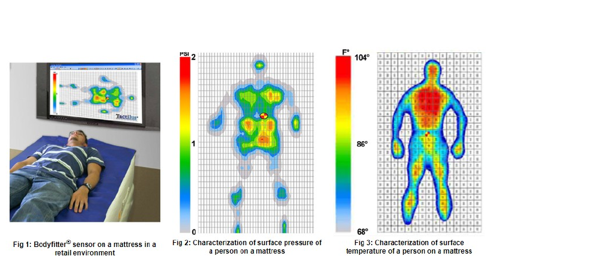{#fig-ch07-4-37}

This example also reveals an I²C limitation. Adding devices and cable length increases capacitance, which slows the rising edges produced by the pull-up resistors. A large physical array may need bus buffers, multiple segments, slower clocking, or local controllers rather than one enormous bus.

### Real-World Example: An I/O Expander

A design sometimes needs more digital inputs and outputs than the microcontroller package provides. An I²C I/O expander uses one bus address and a small set of internal registers to control additional pins. Two microcontroller signals can therefore control banks of LEDs, read a keypad, monitor switches, or operate relays.

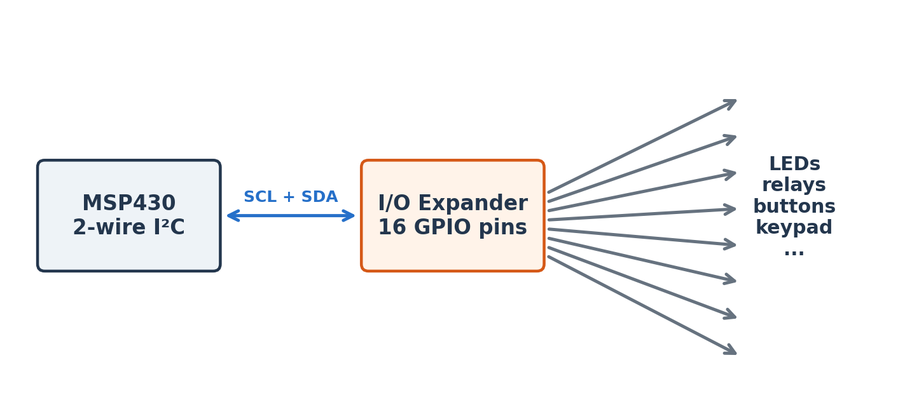{#fig-ch07-4-38}

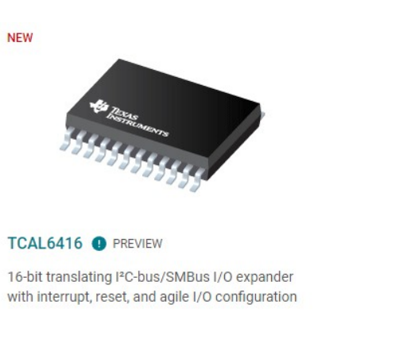{#fig-ch07-4-39}

The added pins are not identical to native GPIO. Every change requires an I²C transaction, so the latency is longer and the maximum update rate is lower. A target cannot initiate an I²C transaction without a controller clock, so many expanders include a separate interrupt output to notify the microcontroller that an input changed.

### When I²C Is a Good Choice

-   Use I²C for configuration registers and moderate-rate sensors located near the controller.

-   Addressing allows many targets to share two signal wires.

-   Acknowledgments reveal whether an address or data byte was accepted.

-   Open-drain signaling requires pull-up resistors and creates a rise-time limit.

-   The shared half-duplex bus is generally slower and more software-intensive than a simple SPI exchange.

-   Address conflicts occur when two targets use the same fixed address unless a multiplexer or alternate address is available.

## Controller Area Network

Controller Area Network, or CAN, is an asynchronous multi-controller serial bus developed for reliable communication among distributed electronic control units. It is strongly associated with vehicles, but it is also used in industrial equipment, robotics, medical devices, and other systems where noise immunity and fault detection matter.

CAN is not a point-to-point character stream like UART. Every node monitors the same bus, and a frame carries an identifier that describes the message rather than a destination address. A node can publish a wheel-speed message, for example, and any interested node can receive it. Hardware acceptance filters allow a controller to ignore identifiers it does not need.

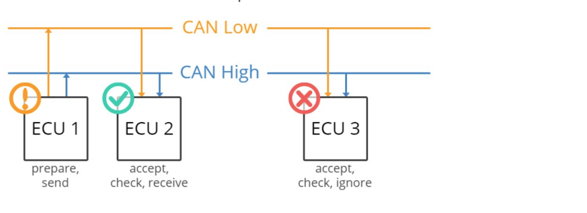{#fig-ch07-4-40}

This returns us to the vehicle example that opened the chapter. The engine controller, braking controller, steering controller, and other subsystems do not need a separate dedicated wire for every value sent between every pair of devices. Instead, they publish structured messages on a shared communication network. CAN provides the physical signaling, message organization, arbitration, and error handling that make this arrangement practical.

### Differential Signaling

A high-speed CAN physical layer uses two wires, CAN_H and CAN_L, arranged as a twisted pair. The receiver interprets the difference between the wire voltages. External noise that couples similarly into both wires changes their absolute voltages but leaves much of the difference unchanged. This common-mode rejection makes differential signaling valuable in electrically noisy environments.

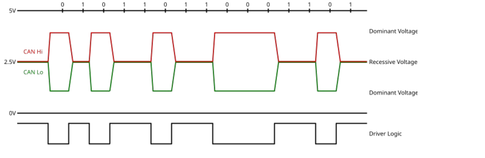{#fig-ch07-4-41}

When the bus is recessive, the two wires remain close to the same voltage, often approximately 2.5 V in a high-speed CAN implementation. A dominant bit drives CAN_H higher and CAN_L lower, increasing the voltage difference. Receivers identify the bit from this differential voltage rather than treating either individual wire as an ordinary single-ended GPIO signal.

A CAN controller does not connect directly to the twisted pair. A transceiver converts the controller’s digital transmit and receive signals into the differential bus voltages. Termination resistors are installed at both physical ends of the bus to absorb signal energy and reduce reflections. The bus should be wired as a line with short stubs rather than as an arbitrary star.

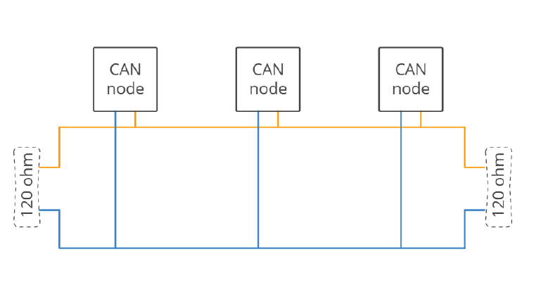{#fig-ch07-4-42}

### The Classical CAN Frame

A Classical CAN data frame includes a start-of-frame bit, an identifier, control information, zero to eight data bytes, a cyclic-redundancy check, acknowledgment, and end-of-frame bits. Standard CAN uses an 11-bit identifier; extended CAN uses a 29-bit identifier. The identifier labels the meaning and priority of the message rather than identifying the physical destination of the frame.

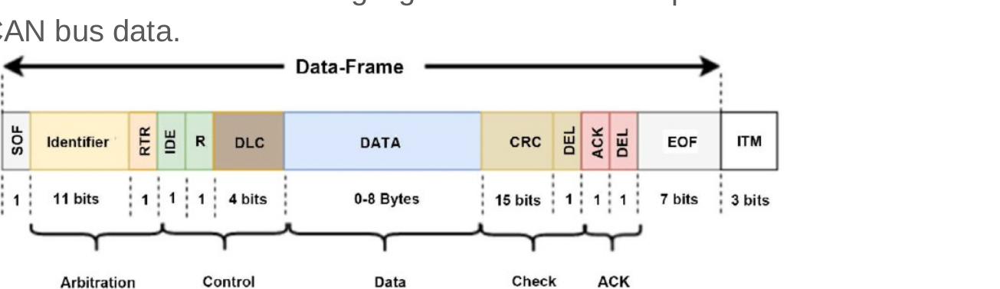{#fig-ch07-4-43}

#### Start of Frame, Identifier, and Arbitration

A dominant start-of-frame bit announces that a node intends to transmit and provides a synchronization edge for the other nodes. The identifier follows. For example, identifier 0x100 might represent engine speed, 0x200 might represent wheel speed, and 0x300 might represent coolant temperature. All nodes observe the message, but each node uses its acceptance filters to decide whether the information is relevant.

Several nodes may begin transmitting at the same time. CAN resolves this using non-destructive bitwise arbitration: a dominant 0 overrides a recessive 1 on the shared bus. Each transmitter monitors the actual bus level. A node that sends recessive but observes dominant knows that another node has higher priority and immediately stops transmitting. The message with the lower numerical identifier continues without being corrupted.

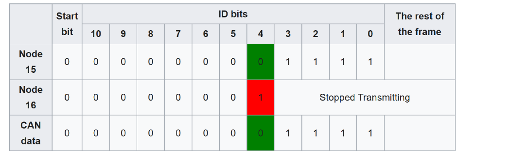{#fig-ch07-4-44}

#### RTR, IDE, Reserved Bits, and Data Length

The remote transmission request, or RTR, distinguishes a frame carrying data from a request for data in Classical CAN. The identifier extension bit, IDE, distinguishes the standard 11-bit identifier format from the extended 29-bit format. A reserved bit, commonly labeled r0, is maintained according to the Classical CAN specification. The four-bit data length code, DLC, indicates how many data bytes appear in the payload.

#### Data, CRC, Acknowledgment, and End of Frame

The data field carries zero to eight payload bytes in Classical CAN. The payload interpretation is defined by the application: a pair of bytes might represent wheel speed, temperature, motor current, or another measurement. The cyclic-redundancy check allows receivers to verify that the protected frame contents arrived without detectable corruption.

For acknowledgment, the transmitter releases an acknowledgment slot as recessive. Any receiver that successfully validated the frame can drive that slot dominant to confirm reception. A transmitter that observes no dominant acknowledgment knows that the frame was not accepted. The end-of-frame field consists of seven recessive bits, marking completion and allowing the bus to return to its idle state.

#### Bit Timing and Stuff Bits

Although CAN uses two physical wires, it does not carry a separate clock. Every node is configured for the same nominal bit rate, and edges in the transmitted signal allow receivers to keep their internal sampling clocks aligned. A long unbroken sequence of identical bits would remove those useful synchronization edges.

Bit stuffing solves that problem by inserting an opposite-polarity bit after a run of five identical transmitted bits in the stuffed portion of a Classical CAN frame. The receiver removes the inserted bit before interpreting the message. The detailed frame below shows how identifier, control, payload, CRC, acknowledgment, and physical-layer waveforms relate to one another.

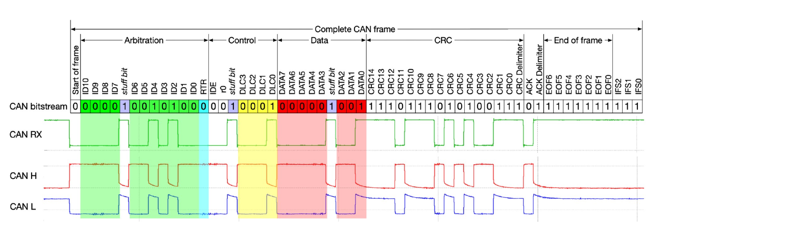{#fig-ch07-4-45}

CRC checks, acknowledgment, transmit monitoring, format checks, and error counters work together to detect faults and prevent a failing node from permanently disrupting the network. These features make CAN more complex than UART, but they support the reliability needed when many distributed controllers share a noisy physical environment.

### Using CAN with the MSP430G2553

The MSP430G2553 does not contain an integrated CAN controller. CAN can still be added with an external controller connected through SPI and a separate CAN transceiver connected to the differential bus. This solution uses more components and software than a microcontroller with built-in CAN, but it is appropriate when the MSP430 remains suitable for the rest of the application.

This example emphasizes the difference among three layers. SPI carries bytes between the MSP430 and the external CAN controller. The CAN controller creates, receives, filters, and checks CAN frames. The transceiver produces and senses the CAN_H and CAN_L voltages. Calling all three components “the CAN interface” can obscure which part is responsible for a failure.

## Choosing a Serial Protocol

There is no universally best serial protocol. A designer should begin with the communication relationship and physical environment rather than personal familiarity. The number of devices, required throughput, distance, noise, pin budget, direction of communication, error-detection needs, and availability of compatible hardware all influence the decision.

### Choose UART When

-   Two devices need a simple point-to-point connection.

-   The devices can agree on a fixed baud rate and frame format.

-   Human-readable debugging through a terminal is valuable.

-   A separate clock wire is undesirable and moderate throughput is sufficient.

### Choose SPI When

-   Peripherals are close to the controller and high throughput is important.

-   The controller can dedicate clock, data, and chip-select pins.

-   Full-duplex shifting or precise controller-generated timing is useful.

-   The device command protocol supplies any needed addressing and checking.

### Choose I²C When

-   Several moderate-speed devices should share two wires.

-   The targets provide unique or configurable addresses.

-   The bus is short enough to satisfy capacitance and rise-time limits.

-   Register-oriented sensor and configuration traffic dominates.

### Choose CAN When

-   Many controllers need to publish and receive messages on one robust network.

-   The electrical environment is noisy or the wiring extends beyond one circuit board.

-   Priority arbitration, hardware filtering, and strong fault detection are required.

-   The design can include a CAN controller and physical-layer transceiver.

A real system often uses several protocols at once. A robot may use I²C for low-rate sensors, SPI for a display and flash memory, UART for a debug console, and CAN for communication between major control units. The protocols are complementary tools, not mutually exclusive architectural philosophies.

## Recap

In this chapter we learned:

-   Serial communication reduces pin and wiring requirements by transmitting bits over time.

-   Synchronous protocols transmit a clock; asynchronous UART reconstructs timing from an agreed baud rate.

-   UART frames data with start, data, optional parity, and stop bits.

-   The MSP430G2553 uses USCI_A0 for UART and exposes UCA0RXD on P1.1 and UCA0TXD on P1.2.

-   Polling is simple, while interrupts and software buffers allow the processor to perform other work.

-   SPI exchanges bits in both directions under a controller-generated clock and selects targets with chip-select signals.

-   I²C uses addressed, open-drain SCL and SDA signals with an acknowledgment after every byte.

-   Repeated START conditions allow an I²C register read to change direction without releasing the bus.

-   CAN combines differential signaling, message identifiers, arbitration, and extensive error detection.

-   The MSP430G2553 needs an external CAN controller and transceiver to join a CAN network.

-   Protocol selection depends on topology, speed, distance, robustness, pin budget, and device support.

## Review Questions

1.  How can the vacuum robot divide bump sensing, motor control, and encoder feedback between two microcontrollers?

2.  Which eight GPIO levels represent decimal 21, and why can the receiver not distinguish the sequence 21, 21, 10 using data levels alone?

3.  How does adding a clock wire solve the repeated-value problem, and why might designers then replace eight data wires with one?

4.  What electrical problem occurs if two push-pull GPIO outputs drive opposing values on the same shared wire?

5.  Why does a parallel bus become difficult to route and time as its width and speed increase?

6.  How does a UART receiver determine when to sample a bit without a transmitted clock?

7.  How long does one 8N1 frame require at 115200 baud? What is the maximum payload byte rate?

8.  Why must TX and RX be crossed in a point-to-point UART connection?

9.  What is the difference between UCA0TXIFG and transmission complete?

10. Why does an SPI controller transmit a dummy byte when it only wants to receive?

11. What happens if two SPI peripherals drive the shared input line at the same time?

12. Why can several I²C devices safely pull SDA low without shorting one output against another?

13. Describe the sequence required to read two bytes from an I²C target register.

14. Why does bus capacitance limit the physical size of an I²C network?

15. How could an MSP430 and MPU6050 cooperate to detect a potentially dangerous impact on a smart hard hat?

16. How does CAN arbitration allow the highest-priority frame to continue without corruption?

17. Which protocol would you choose for a terminal, a microSD card, a temperature sensor array, and communication among vehicle controllers? Explain each choice.

## References

Texas Instruments. MSP430G2x53, MSP430G2x13 Mixed-Signal Microcontrollers Data Sheet, SLAS735.

Texas Instruments. MSP430F2xx, MSP430G2xx Family User’s Guide, SLAU144K, revised August 2022. https://www.ti.com/lit/ug/slau144k/slau144k.pdf

Texas Instruments. MSP-EXP430G2 LaunchPad Experimenter Board User’s Guide, SLAU318.

NXP Semiconductors. I²C-bus Specification and User Manual, UM10204. https://www.nxp.com/docs/en/user-guide/UM10204.pdf

Bosch. CAN Protocols and CAN Controller IP Documentation. https://www.bosch-semiconductors.com/products/ip-modules/can-protocols/

TDK InvenSense. MPU-6000 and MPU-6050 Product Specification and Register Map.
